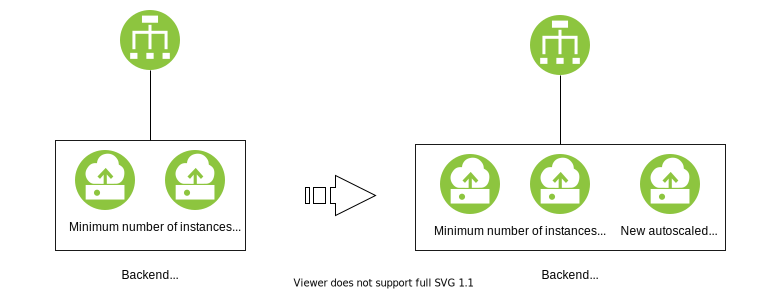
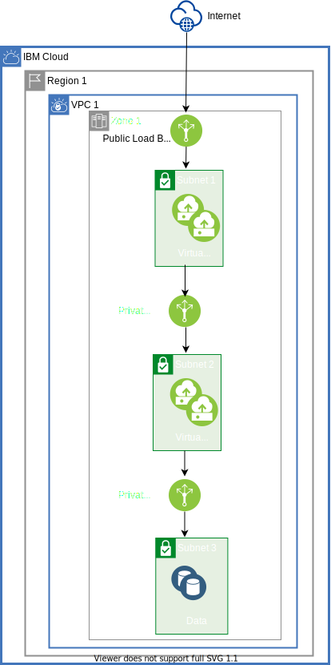
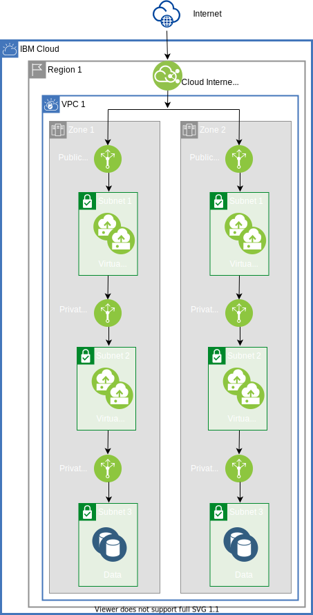
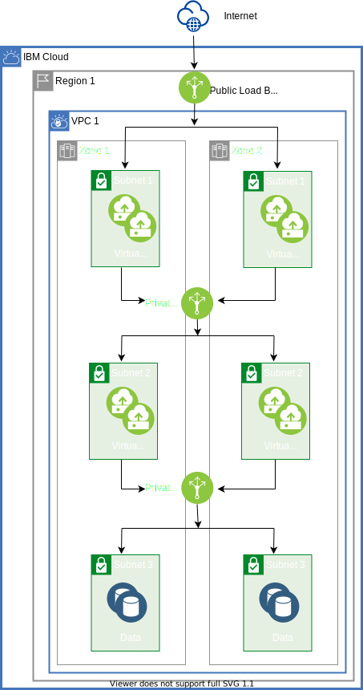

---

copyright:
  years: 2020
lastupdated: "2020-03-25"

keywords: high availability, regions, zones, resiliency

subcollection: cloud-infrastructure

---

{:shortdesc: .shortdesc}
{:codeblock: .codeblock}
{:screen: .screen}
{:new_window: target="_blank"}
{:tip: .tip}
{:note: .note}
{:external: target="_blank" .external}

# Building a highly available 3-tier web application in VPC
{: #ha-3-tier}

This reference architecture describes three methods of deploying a 3-tier web application on {{site.data.keyword.vpc_full}}. This information applies to most 3-tier web applications that need to be resilient and highly available applications

|Tier|Description|
|---|---|
|The front-end web tier|The 1st- tier is usually the user interaction that takes in user input and parses the data to be handed off to the next tier.
|The application tier|The 2nd-tier takes the data from the web tier to process and apply logic. This action can include writing or pulling data from the data tier or providing results back to the web tier.
|The data tier|The 3rd-tier stores the application data that can be in written form or query from. The storage varies across different storage technologies, such as block volumes or object storage, depending on the application requirements.

## Deployment Considerations
{{site.data.keyword.vpc_short}} is only offered in multizone regions (MZR) which are made up of three or more zones. Each zone is isolated from each other to contain failures within a zone. The zones are also interconnected with a high-speed connection for higher bandwidth and lower latency for intra-zone communications.

## Component Considerations

### Virtual Servers

Servers in each of the 3-tiers have different requirements. When you provision your virtual servers, you have multiple options for virtual server profiles: Balanced, Compute, and Memory. The vCPU-to-memory ratio varies across the different profiles, but within the profile the ratio is constant. Within a profile, the number of vCPU and memory increases along with the bandwidth performance. Use the following information when you are provisioning your servers.

|Tier|Server requirements|
|---|---|
|Front-end web tier|This tier tends to be higher in traffic workload. These workloads are more CPU-intensive than memory-intensive. So, you want to select a Compute profile that has a vCPU ratio to memory of 1:2. Within the Compute profile, select the appropriate type based your vCPU and memory requirements.|
|Application tier|This tier tends to be more memory-intensive and involves more caching. For this workload, select a Memory profile where the ratio of vCPU-to-memory is more weighted to the memory, 1:8.|
|Data tier|If you are using a virtual instance as the database, select a Balance profile that offers more balance between vCPU and memory, such as 1:4.|

### Load balancers
You can order two types of load balancers from IBM Cloud. While both load balancers can distribute both HTTP/HTTPS and TCP traffic, each provides different capabilities that might be more suited for different deployment types.

1. You can deploy {{site.data.keyword.loadbalancer_full}} either in public or private scenarios. For a public scenario, the load balancer has a public interface to take incoming traffic from the internet and distribute the traffic through its private interface connecting to the virtual servers as shown [Scenario 1 - deploying in single zone](#single-zone). For a private scenario, the incoming and distributed outgoing traffic goes through private subnets, such as the traffic between the application tier and the data tier.

  {{site.data.keyword.Bluemix_notm}} {{site.data.keyword.loadbalancer_short}} also provides horizontal scaling to better handle increased traffic load. 

  You can configure the {{site.data.keyword.loadbalancer_short}} back-end listener across multiple zones. When you do this configuration, a secondary load balancer is automatically provisioned and deployed in an active-active fashion for better availability. See [Scenario 2 - deploying in multiple zones with {{site.data.keyword.cis_full_notm}}](#multi-zone-cis).

2. {{site.data.keyword.cis_full}} is a global load balancer that acts as a public load balancer only. Typically, it is deployed for global applications across multiple regions. {{site.data.keyword.cis_short}} is geo-aware and steers the traffic to the zone that is closest to the requester.

In [Scenario 2 - deploying in multiple zones with {{site.data.keyword.cis_full_notm}}](#multi-zone-cis), {{site.data.keyword.cis_short}} distributes traffic between zones. {{site.data.keyword.cis_short}} allows you to create multiple server pools and origins to allow 1:N type of deployment – one application to multiple server pools and origins. One application that is deployed across multiple server pools is helpful for DevOps management.

### Storage
Storage can be a virtual server with block volumes or {{site.data.keyword.cos_full}}. If your application requires lower latency and higher IOPs, use a virtual server with block volumes. You need a 3rd-party tool to provide replication or snapshots. For unstructured data and high data volumes, use {{site.data.keyword.cos_short}}. The {{site.data.keyword.cos_full_notm}} service has different tiers where replication varies such as within a zone, across multiple zones, or across regions. The replication is not instantaneous, but occurs over time.

### Security

{{site.data.keyword.Bluemix_notm}} provides both security groups and firewall access control lists (ACL). For host-based security, consider using security groups to preserve the firewall ACLs. Firewall ACLs are best used when they are applying the same security rule at a subnet level rather than at the host level.

## Capacity Considerations
{: #capacity-considerations}

When it comes to availability, customers tend to focus on failed or maintenance events because their services need to be available during any resource loss, whether the event is expected or unexpected. An often overlooked factor of resource availability is capacity. Capacity tends to be hard to plan for, as deployed resources need to meet the current demands while also handling spikes or seasonal load increases. The capacity must cover a wide range of load conditions while also balancing the economics for the workload.

If the current resources cannot handle the increased workload demands, then incoming transaction requests are at risk of being ignored or dropped, which in turn creates an availability problem.

Auto scale helps address these challenges by scaling resources up and down based on different load conditions. Auto scale adjusts resources in an automated and orchestrated fashion and is available in both compute and cloud load balancer configurations. 

* Compute – Scaling the virtual server instances is determined by the average target load utilization across all of the virtual server instances in the Auto scale group. Target load utilization can be based on CPU, memory, or network or a combination of these resources. If the virtual server instances' load is not at the wanted target load, then instances automatically scale - up or down - to meet the average target load utilization. The number of virtual server instances that are being added or deleted will exceed the minimum or maximum virtual server instances for an Auto scale group. More information on Auto scale can be found [here](/docs/vpc?topic=vpc-creating-auto-scale-instance-group). 

{:caption="Figure 1. Auto scale Compute adds virtual servers based on load" caption-side="bottom"}

* Cloud load balancers – Auto scale for the cloud load balancer has two parts. The first part is the horizontal scaling of the cloud load balancer. The cloud load balancer scales depending on load so that it does not become the bottleneck. This process is managed by the IBM cloud controller. The second part is making the cloud load balancer aware of membership changes to the backend server pool. In a non-Auto scale environment, this adjustment is made by the customer manually; the customer must add or remove virtual instances from the backend server pool. With Auto scale, this adjustment is an automated process and removes the need for customer intervention. 

{:caption="Figure 2. Auto scale Cloud Load Balancer distributes load to autscaled virtual servers" caption-side="bottom"}

## Scenario 1 - deploying in single zone
{: #single-zone}

Deploying your web application in only one of the three MZR zones of a VPC provides the best low latency solution because all of the services are in close proximity and contained within a single zone.

When deploying in a single zone, deploy multiple virtual instances within a tier for better availability and capacity. No load balancer is required.

This deployment type has some risk. While you deploy multiple virtual instances, the application is not protected against a failure within a data center. This becomes a single point of failure for the application. 

{:caption="Figure 3. Deploying in single zone" caption-side="bottom"}

## Scenario 2 - deploying in multiple zones with {{site.data.keyword.cis_full_notm}}
{: #multi-zone-cis}

You can deploy your application as active-active across multiple zones by using a combination of {{site.data.keyword.cis_full_notm}} and {{site.data.keyword.Bluemix_notm}} {{site.data.keyword.loadbalancer_short}}. This method enables replication across multiple zones, increasing the availability of the application. Because of the active-active deployment, more devices are available for parallel processing, improving resiliency and performance. The likelihood of simultaneous failure across multiple zones is much less likely in comparison to a single zone. If a failure occurs in one of the zones, the failure is contained in that zone. Even though the capacity is reduced during a failure, the application is still active in the other zone.

{:caption="Figure 4. Deploying in multiple zones with IBM Cloud Internet Services and IBM Cloud Load Balancer" caption-side="bottom"}

By deploying across multiple zones you can also take advantage of server pools and origins, which are part of {{site.data.keyword.Bluemix_notm}} {{site.data.keyword.cis_short}}. allow DevOps to integrate, validate, and deploy new software features. **More information is covered in a later section of this document.**

## Scenario 3 - deploying in multiple zones with {{site.data.keyword.Bluemix_notm}} {{site.data.keyword.loadbalancer_short}}

You can also deploy your application in multiple zones by using only {{site.data.keyword.Bluemix_notm}} {{site.data.keyword.loadbalancer_short}} rather than a combination of {{site.data.keyword.cis_full_notm}} and {{site.data.keyword.Bluemix_notm}} {{site.data.keyword.loadbalancer_short}}. This deployment scenario is less ideal, but is more cost-effective. You should consider this method only for less critical and less sensitive applications, such as internal applications.

{:caption="Figure 5. Deploying in multiple zones with {{site.data.keyword.Bluemix_notm}} {{site.data.keyword.loadbalancer_short}} " caption-side="bottom"}

## Reference
For more {{site.data.keyword.Bluemix_notm}} high availability content , see:
* [Architecting highly available cloud solutions](https://www.ibm.com/garage/method/practices/run/cloud-platform-for-ha)
* [Application-level high availability](https://www.ibm.com/garage/method/practices/run/application-level-ha)
* [Deploying server pools and origins in a single MZR](/docs/cloud-infrastructure?topic=cloud-infrastructure-ha-pools-origins)
