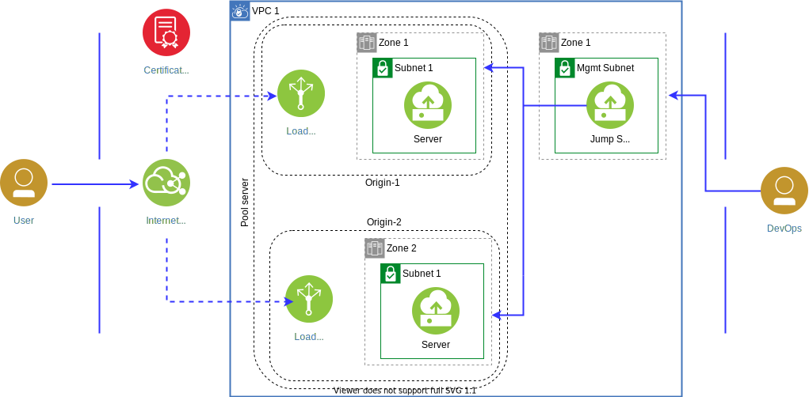

---

copyright:
  years: 2020
lastupdated: "2020-08-31"

keywords: high availability, regions, zones, resiliency

subcollection: cloud-infrastructure

---

{:shortdesc: .shortdesc}
{:codeblock: .codeblock}
{:screen: .screen}
{:new_window: target="_blank"}
{:tip: .tip}
{:note: .note}
{:external: target="_blank" .external}

# Enabling Auto scale for better capacity and resiliency
{: #ha-auto-scale}

This tutorial shows you how to set up compute (virtual server instance – VSI) Auto scale for horizontal scaling. The setup includes enabling the backend orchestration to add the newly created VSIs to the backend server pool for the cloud load balancer.

## Objectives
{: #ha-auto-scale-obj}

* Learn how to create an Auto scale template and group for the VSI
* Learn how to enable the backend orchestration to add newly created VSIs to the backend server pool for the cloud load balancer

## Services Used
{: #ha-auto-scale-serv}

* IBM Cloud Virtual Private Cloud
* IBM Cloud Virtual Servers for Virtual Private Cloud
* IBM Cloud Load Balancers
* Auto scale

## Architecture
{: #ha-auto-scale-arch}

{:caption="Figure 1. Deploying server pools and origins in single MZR" caption-side="bottom"}

## Before you begin
{: #ha-auto-scale-before}

This tutorial builds on the [Deploying server pools and origins in a single MZR](/docs/cloud-infrastructure?topic=cloud-infrastructure-ha-pools-origins) solution tutorial. If you don’t have an environment or need to rebuild your environment, use that tutorial to set it up.

You must remove any virtual server instances from the back-end server pool before you start this task. Auto scale requires an empty back-end server pool; an empty back-end pool has no servers that are attached to it.  

## Create Instance templates for VSI
{: #ha-auto-scale-inst-temp}

To create an Auto scale instance template for the VSI, complete the following steps:
1.	From the VPC overview page, scroll down to **Auto scale** and click **Instance templates**.
2.	Click **Create +**.
3.	In the New instance template:

 a. Enter *vpc-region1-zone1-template* for the instance template **Name**.

 b. Select *vpc-region1* as the name for your VPC.

 c. Select a **Resource group**.

 d. Select *Dallas 1* for the **Location**.

 e. Select the appropriate image for **Image**.

   If you select a stock image, you must do post-provisioning for the new VSIs to match the same functions as your current production web server. If you select a custom image (for example, snapshot of the web server), you might have minimal or no post-provisioning. 
   {: note}

  f. Select *jumphost-vsi* for the **SSH key**.

  g. For **Network interface**:

   * Select *vpc-region1-zone1-subnet* as the **Subnet**.
   * Ensure *vpc-region1-webserver-sg* is the only item that is selected in **Security Groups**.

4.	Click **Create instance template**. 

## Create Instance group
{: #ha-auto-scale-inst-grp}

To create the Auto scale instance groups, complete the following steps:

1.	From the VPC overview page, scroll down to **Auto scale** and click **Instance groups**.
2.	Click **Create +**.
3.	Under **New instance group for VPC**:

  a. Enter *vpc-region1-zone1-group* for the instance group **Name**.

  b. Select a **Resource group**.

  c. Optionally, add **Tags** to organize your resources.

  d. Select *Dallas* for your **Region**.

  e. Select *vpc-region1-zone1-template* for **Select instance template**.

  f. For **Select subnets and load balancer**:

  * Select *vpc-region1-zone1-subnet* for the **Subnet**.
  * Check **Use load balancer**.

       Selecting the **Use load balancer** option, enables the backend orchestration to add newly created VSIs to the backend server pool. When enabled, the backend orchestration informs the load balancer about any virtual servers that are created by the Auto scale feature and adds any created virtual servers to the backend pool servers. This selection is optional.
       {: note}

      * Select *vpc-lb-region1-zone1* for **Load Balancer**.
      * Select *region1-zone1-pool* for **Pool**.
      *	Enter the appropriate network port for **Application port**, *80* for HTTP or *443* for HTTPs.

  g. Select *Dynamic* for **Choose scaling method**.

  h. For **Set instance group size**:

  *	Enter *1* for **Minimum instances**
  *	Enter *3* for **Maximum instances**
  *	Enter *90* for **Aggregation window** 
  *	Enter *120* for **Cooldown period**

   The minimum and maximum instance is the total of all instances (of current plus auto scaled instances). In our case, since we only started with 1, then the minimum is 1. Also, when you are choosing the maximum number, ensure that the subnet has enough spare IP addresses to accommodate any new provisioned VSIs that are created by the Auto scale feature. 
   {: tip}

   The instance group size values are for demonstrative purpose. There is no exact formula to determine these values as it depends on your business and application requirements. More often than not, it takes several test iterations to find the right values.
   {: note}

  i. Click **Add a policy** under **Create scaling policies**:

  * Select *Network out (Mbps)* for **Metric type**. 
  * Enter *1* for **Average target utilization**.

  Again, the resource and utilization values are target-based thresholds. The values that are used here are for demonstrative purpose only. Any values that you use should be based on your requirements and just like the instance group size, it might take a couple of test iterations to find the right values. If there are multiple scaling policies (for example, CPU and memory), then the membership calculation is done for each policy and the policy that has the higher membership wins.
  {: note}

4.	Check that you agree that instances are created and reclaimed according to the instance group settings. 

5.	Click **Create instance group**.

## Related Content

For a detailed example, watch the video [Don't let load be the reason for the 404 error](https://video.ibm.com/channel/23944579/video/mv8ajs){: external}
