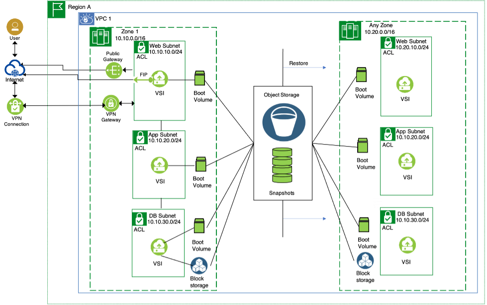

---

copyright:
  years: 2021
lastupdated: "2021-06-25"

keywords: high availability, regions, zones, resiliency
content-type: tutorial
services: virtual-servers, vpc, loadbalancer-service
account-plan: paid
subcollection: cloud-infrastructure

---

{:shortdesc: .shortdesc}
{:codeblock: .codeblock}
{:screen: .screen}
{:new_window: target="_blank"}
{:tip: .tip}
{:note: .note}
{:external: target="_blank" .external}
{:step: data-tutorial-type='step'}

# Regional snapshots in 3-tier architecture
{: #regional-snapshots-3-tier-arch}

Block storage snapshots can be created in {{site.data.keyword.cloud}} VPC Gen2. You can use this feature for a backup and restore of a 3-tier application. Block storage snapshots can also be used to scale out a 3-tier system with minimal changes to your application. 

 {: caption="Figure 1. Regional snapshots in 3-tier architectures" caption-side="bottom"}

This architecture diagram shows a single zone 3-tier application that is spread across three different subnets. The same architecture can be extended to multiple zones (MZRs) as well.

1.	Web tier that is running in web subnet and has only a bootable volume.
2.	Middle tier that is running in application subnet and has only a bootable volume.
3.	A database machine that is running in a separate DB subnet. Apart from the boot volume, you also have a secondary volume block storage that is attached to the virtual server instance that is hosting the database files.

All the three tiers are isolated with NACLs and SGs. Only the necessary ports that are needed for the data flow between the tiers are opened.

## Snapshots overview
{: #snapshot-overview}

You can back up the data on your boot volumes and secondary storage block volumes that are attached to Virtual Server Instances by taking point in time snapshots. Snapshots can be taken both on bootable and secondary data volumes. If you experience accidental data deletion, you can create new data volumes from the backup snapshots and selected files can be copied over. If the snapshot was taken on a bootable volume, you can create another virtual server instance from the snapshot.

Snapshots of the volumes reside in regional IBM Cloud Object Storage buckets. To take snapshots, volumes must be attached to active virtual server instances. The first snapshot is a full snapshot and the subsequent snapshots are incremental. Snapshots inherit the encryption keys of the parent volume. 

## Using snapshots for 3-Tier applications
{: #using-snapshots-3-tier-apps}

On a 3-tier application, snapshots work as backups, and they are the first line of defense for data protection. While critical applications might need a suite of HA and DR solutions, a non-mission critical and non-production system can rely on backup snapshots.

Snapshots can be used not only for application backups but also to create a copy of the applications either in the same zone or in another zone within a region. The applications can then be configured with a load balancer. 

When you create the boot volume from snapshots, for web, MT or DB boot volumes, the instance profile does not have to be the same as the virtual machine profile that created the snapshot. This arrangement helps in use cases where you want to swap out virtual machines with higher capacities when they are under a load balancer. Creating new virtual server instances with snapshots needs only minimal changes to the software. These changes can be done through boot strap scripts.

Data volumes can be restored and attached to any other virtual server instances. This arrangement helps in use cases where user deletes a configuration file or drops a database table. The volume can be restored to another virtual server instance, to a temporary database that is created from the backup snapshot, and the deleted file or dropped table can be restored. 

You can also restore the snapshots to a higher capacity and IOPS profiles and not necessarily to the same volume profiles as the source volume.

## Taking manual snapshots of your 3-tier applications
{: #snapshots-3-tier-apps}

A bootable snapshot can be taken for the web, app, and db machines. A non-bootable snapshot can be taken for the database block storage. To get a crash consistent snapshots for critical applications like databases, quiesce the database.

You can create snapshots either from Cloud UI, or with CLI or API. For more information, see [Creating Snapshots](/docs/vpc?topic=vpc-snapshots-vpc-create). After the first snapshot, all additional snapshots are incremental.

## Scheduling snapshots
{: #schedule-snapshots}

Snapshots can be scheduled by running an API through a cron job. However, before you run the API you need to create a service ID and retrieve the access token. For more information, see [Retrieving an access token](/docs/key-protect?topic=key-protect-retrieve-access-token) for creating the service ID and retrieving the access token. 

After the service ID is set up, the iam token can be retrieved programmatically and the token can be passed to API call, for creating the snapshots. For more information, see [API documentation for snapshots](/apidocs/vpc#create-snapshot). The process of quiescing your apps, retrieving the access token, and passing the token to API for creating the snapshots, can be scripted and passed to a cron job. You can create a schedule to delete the snapshots as well.

## Restoring Snapshots
{: #restore-snapshots}

You can restore the volumes either boot or data volumes from the snapshots that were created earlier. Apart from using the snapshots as backups, you can also restore both boot and data volumes together. For more information on restoring snapshots, see [Restoring a volume from a snapshot](/docs/vpc?topic=vpc-snapshots-vpc-restore#snapshots-vpc-restore). 

## Limitations
{: #vpc-snapshots-limits}

For the current limitations of snapshots in VPC cloud, see [Limitations](/docs/vpc?topic=vpc-snapshots-vpc-about#snapshots-vpc-limitations). 

## Additional resources

For more information about snapshots, see [About Snapshots for VPC](/docs/vpc?topic=vpc-snapshots-vpc-about)

