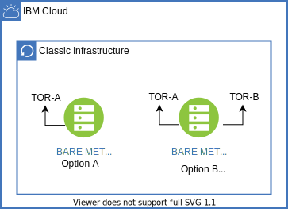
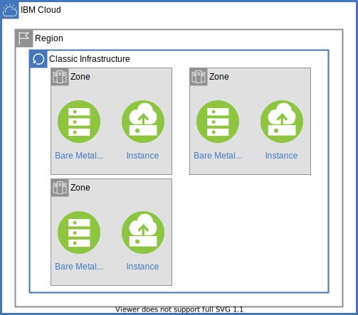
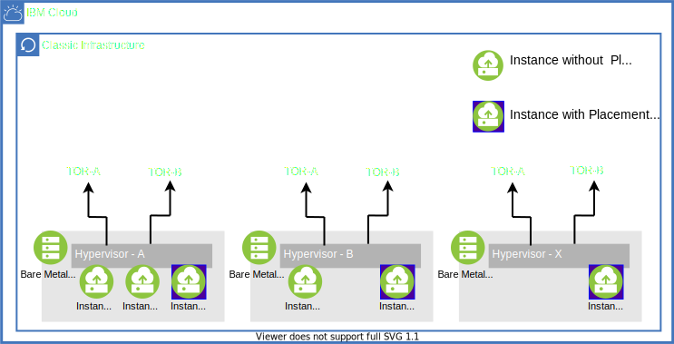
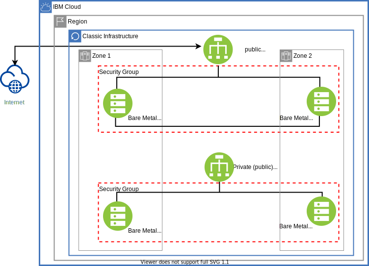

---

copyright:
  years: 2020
lastupdated: "2020-03-25"

keywords: high availability, regions, zones, resiliency

subcollection: overview

---

{:shortdesc: .shortdesc}
{:tip: .tip}
{:note: .note}
{:new_window: target="_blank"}

# Configuring high availability for stateless applications
{: #ha-introduction}

This topic is a high-level summary of high availability for stateless applications, such as a front-end application that is deployed on {{site.data.keyword.Bluemix}} infrastructure layer (IaaS). Stateless applications don't store persistent data, but are still required to meet a service level for high availability.

## Data Centers, Regions, and Availability Zones
{: #ha-data-centers}

As an IBM classic infrastructure (non-VPC) customers you can order bare metal or virtual server instances and can deploy to over 60 data centers that are located around the world in addition to several multi-zone regions with multiple availability zones.

The data centers are in different geographies, countries, and regions. Whether the data centers are multi-zone (MZR) or not, all of them maintain multiple power feeds, fiber links, dedicated generators, and battery backup to avoid a single-point-of-failure (SPOF) between zones and regions. While all the data centers have multiple power feeds, several of the more mature sites such as AMS01, DAL05, 06, 08. FRA02. HKG02, MEX01, MIL01, PAR01,SJC01, SNG01, WDC01, and WDC03 have some 1U single socket server chassis that might not accommodate a dual power feed. If you have a 1U single socket server in one of these sites, you might want to consider a 2U chassis with redundant power supplies. For more information about availability zones, see [Locations for resource deployment](/docs/overview?topic=overview-locations).

The advantage of an MZR is that it provides consistent cloud services across the different zones, better resiliency, availability, higher interconnect speed between data centers for cloud platforms, and infrastructure services such as {{site.data.keyword.cos_full}}, and {{site.data.keyword.Bluemix_notm}} load balancers. These features can be critical to your applications. Deploying the application in an MZR rather than a single zone can increase the availability from 3 9’s to 5 9’s when deployed over three zones.

### PODs
{{site.data.keyword.Bluemix_notm}} data centers are also based on POD architecture where each data center can have more than one POD, depending on on-demand buildout. Each POD consists of racks, servers, networks, and storage, along with backup power generators. Placing the application servers across PODs further improves the availability.

See [Locations for resource deployment](/docs/overview?topic=overview-locations#mzr-table) for a complete list of regions and data centers.

## Bare metal, virtual server deployment model for Classic Infrastructure

With {{site.data.keyword.Bluemix_notm}}, you can control which compute resource you want to deploy your workload or application. Whether it is bare metal for dedicated resource and better performance, or virtual for deployment speed, agility, and cost, it is important to understanding the network connectivity from the server to the top-of-rack (TOR) and how it plays into redundancy is critical.

### Linking your bare metal server

For bare metal servers, you can order a server as a single link or redundant link. If the workload doesn’t have any redundancy that is built into its application, it is best to order a redundant link for added link protection.

If your workload already has redundancy built in to the application, whether it is through clustering or replication, you might be considering a single link rather than a redundant link to reduce costs. Keep in mind that having a redundant link is still a better option because it eliminates the link as the single point of failure (SPOF) and provides more bandwidth to the server.

Note: Some of the older data centers provide only single link connection. In this case, make sure that your workload has redundancy that is built in to the application. SEA01, for example is a single 1G connection. Data centers that support only single 10G connections include AMS01, DAL05/06/07, SJC01, and WDC01.

### Network interface controller

The network interface controller (NIC) provides the link that connects your bare metal or virtual server to the network for communication. A common practice is to teaming two interfaces on the NIC to create a logical interface for redundancy and increase bandwidth. You have different options for teaming ports together.
1.Teaming the links with Link Aggregation Control Protocol (LACP). This protocol negotiates with the upstream switches to form the bundle, providing a better traffic distribution to and from the bare metal or virtual server.
2. Distribute traffic by using the operating system. This method provides switch-independent teaming.
3. Allow the {{site.data.keyword.Bluemix_notm}} provisioning service create the NIC teaming by using LACP or opt to do the NIC teaming yourself through different NIC team modes such as active-passive, round-robin, adaptive transmit load-balancing, or adapter load-balancing.

{:caption="Figure 1. Two different types of bare metal deployment. Option B with LACP nic bonding is recommended for higher availability." caption-side="bottom"}

Note: For VMware, LACP is not available, but other NIC teaming mode is allowed.

### Virtual server

In the case of virtual server, you do not control which host and hypervisor the virtual server is instantiated on. It is controlled by the {{site.data.keyword.Bluemix_notm}} scheduler. You also do not need to worry about the redundant link to the host/hypervisor. Redundancy is already configured to remove the link failure as a SPOF.

It is also best practice to deploy the boot volume on SAN over a local disk. If of the host is experiencing a hard shutdown, IBM hypervisor manager evacuates and migrates the virtual server to a different host. This action is only available when the boot volume is on SAN.

{: caption="Figure 2. The hypervisor with a redundant link connection with NIC bonding configured." caption-side="bottom"}

## Workload Placement for bare metal

Many events can cause server outages. Some are planned and within your control and others are unforeseen events such as hardware failures, software bugs, network issues, and even maintenance that didn’t go as planned. Multiple application servers should be implemented to avoid and eliminate these potential outages. Spinning up multiple applications is not enough. Where the application server is deployed needs to be considered so that you avoid a single fault domain.

For bare metal servers, you want to spread the server application across multiple data centers. By placing the application servers across PODs, availability is improved.

While each POD supports multiple VLANs, you can order extra VLANs at the POD level rather than the data center level. As you order the bare metal server, you can assign the bare metal server to the VLANs to dictate server deployment across PODs within a data center.

{: caption="Figure 3. Compute resources deployed in different zones/data centers." caption-side="bottom"}

## Workload Placement for virtual servers

The default behavior for the IBM scheduler is to place the virtual servers in available hypervisors first, which can result in virtual servers being placed within the same hypervisor. This can be catastrophic if any or all of the virtual servers are deployed on the same hypervisor. A hardware (HW) or software (SW) failure can cause a disruption.

{{site.data.keyword.Bluemix_notm}} provides two solutions to help avoid the virtual servers being deployed on the same hypervisor.
1. Use a dedicated virtual server. This option allows you to own the entire hypervisor and control the placement of the virtual servers.
2. Use Placement Groups. Placement Groups is an anti-affinity feature. If virtual servers are marked in the same placement group, then these virtual servers is instantiated across different hypervisors. By putting the virtual servers in placement groups, availability is improved. For more information about dedicated servers and placement groups, refer to the {{site.data.keyword.Bluemix_notm}} Documents, [Dedicated virtual server](https://cloud.ibm.com/docs/vsi?topic=virtual-servers-dedicated-virtual-servers) and [Placement Groups](https://cloud.ibm.com/docs/vsi?topic=virtual-servers-placement-groups).

{: caption="Figure 4. virtual servers deployed with placement groups are instantiated on different hypervisors which will give a higher availability than with virtual servers without placement groups." caption-side="bottom"}

## Network Services

As part of the IaaS, it is not uncommon to deploy other types of network services for security or remote access. While these services do not help improve the overall availability of the application, they can be a SPOF as the traffic might transit through them. The document does not go into the design but addresses salient points in the context of high availability.

### Direct Link

Direct link provides you with a way to connect to your on-premises resources to {{site.data.keyword.Bluemix_notm}} resources in classic infrastructure. There are different types of direct-link offerings that vary by pricing and capabilities. To read more about direct link, refer to the {{site.data.keyword.Bluemix_notm}} on [Direct Link](https://cloud.ibm.com/docs/infrastructure/direct-link?topic=direct-link-get-started-with-ibm-cloud-direct-link#get-started-with-direct-link?cm_sp=Cloud-Product-_-OnPageNavCTA-IBMCloudPlatform_IBMCloudInternetServices-_-DirectLink_Browse_Documentation).

Regardless of which offering is chosen, keep in mind that by design, direct link is a single link and presents as a SPOF. You can consider ordering two direct links for redundancy to protect against the SPOF. Direct links can provide diverse connections that enable you to achieve redundancy trough BGP. More information see [Models for diversity and redundancy in Direct Link on Classic](https://cloud.ibm.com/docs/direct-link?topic=direct-link-models-for-diversity-and-redundancy-in-direct-link).

### Gateway Appliance

Another network offering that is provided by {{site.data.keyword.Bluemix_notm}} is {{site.data.keyword.Bluemix_notm}} Gateway Appliance. Gateway Appliance is a specialized appliance that gives you control over the network reachability and improves network security for both public and private networks. For more information, see [About {{site.data.keyword.Bluemix_notm}} Gateway Appliance](https://cloud.ibm.com/docs/gateway-appliance?topic=gateway-appliance-getting-started).

Gateway Appliance can be ordered alone or in pairs for high availability. The default order is with high availability. When using a gateway appliance for high availability, consider configuring Virtual Router Redundancy Protocol (VRRP) for redundant computer gateways and synchronizing configurations across the appliances. For more information, see [Working with High Availability (HA) and VRRP](https://cloud.ibm.com/docs/virtual-router-appliance?topic=virtual-router-appliance-working-with-high-availability-and-vrrp) and synchronizing configuration information can be found [Synchronizing High Availability (HA) configurations](https://cloud.ibm.com/docs/virtual-router-appliance?topic=virtual-router-appliance-synchronizing-high-availability-configurations).

Note: Gateway appliance is POD-specific. If your application server is spread across different PODs, you need to order more gateways for the PODs that the application server resides in. Configurations synch does not handle cross-POD synchronizing. You need to coordinate to ensure rules that are consistent across PODs.

### {{site.data.keyword.Bluemix_notm}} Load Balancers

When you have multiple servers such as web servers or databases, incoming requests need to be distributed. Load balancers provide this function by sitting in front of the servers, taking incoming requests, and distributing the network or application across a number of backend servers. This distribution allows for higher performance because it increases capacity by allowing more concurrent sessions. A load balancer also provides for a better user experience and availability by preventing a single server from getting overburdened.

{{site.data.keyword.Bluemix_notm}} offers several load balancers, including {{site.data.keyword.loadbalancer_full}} and {{site.data.keyword.cis_full}} for the classic infrastructure. For information on all load balancer options, see [Load Balancers] (https://www.ibm.com/cloud/load-balancer).

#### {{site.data.keyword.Bluemix_notm}} {{site.data.keyword.loadbalancer_short}}

The {{site.data.keyword.Bluemix_notm}} {{site.data.keyword.loadbalancer_short}} is an IaaS cloud load balancer that operates in a single data center. It supports both HTTP/HTTPS and TCP-based applications either as public, private load balancer, and public-to-public. It has on-demand scalability based on load: scaling up as load increases and down when load decreases.

Other key load-balancing features of {{site.data.keyword.loadbalancer_short} include:

* Public (internet-facing) load balancer
* Internal (private) load balancer
* Traffic distribution based on Layer-4 port information and Layer-7 (HTTP/HTTPS)
* SSL offload
* Layer-4 health checks for TCP ports and Layer-7 health checks for HTTP

Additionally, when the load balancer is deployed in a data center that is part of an MZR and your account has VLAN spanning or VRF enabled, then a second load balancer is instantiated in another data center that is part of the same MZR in an active-active fashion. This configuration is visible to you and provides an extra layer protection against failure, increasing reliability and availability of your application on {{site.data.keyword.Bluemix_notm}}.

{: caption="Figure 5. {{site.data.keyword.Bluemix_notm}} Load Balancer supporting either or both public and private (internal) deployment." caption-side="bottom"}

#### {{site.data.keyword.cis_full_notm}}

{{site.data.keyword.cis_full_notm}} ({{site.data.keyword.cis_short_notm}}) is a suite of services that includes DNS, Global Load Balancing (GLB), Web Application Firewall (WAF), DDoS mitigation, and Content Delivery Network (CDN). For more information, see that More information can be found [IBM Cloud Internet Services](https://www.ibm.com/cloud/cloud-internet-services).

Similar to {{site.data.keyword.Bluemix_notm}} Load Balancer, {{site.data.keyword.cis_short_notm}} supports load balancing for HTTP/HTTPS like. {{site.data.keyword.cis_short_notm}} also goes further to solve a different set of problems such as local load balancing and distributed applications that are deployed in different regions or geographies.

Some of the other key load-balancing features of {{site.data.keyword.cis_short_notm}} are:
* Public (internet-facing) load balancer
* Local and global load balancing
* Pool base distribution
* TCP, HTTP, and HTTPS health checks

The following diagram illustrates a common three-tier web app use case that uses both {{site.data.keyword.Bluemix_notm}} Load Balancer offerings. {{site.data.keyword.cis_short_notm}} directs traffic based on user origin while also providing backup if there is a failure at the primary location, where US-East is backing up EU-GB and vice versa. While an {{site.data.keyword.Bluemix_notm}} Load Balancer can sit in between {{site.data.keyword.cis_short_notm}} and the web server, in this case, it is deployed as an internal load balancer between web and app tier.

{: caption="Figure 6. 3 tier web app with {{site.data.keyword.cis_short_notm}} and {{site.data.keyword.loadbalancer_short}}." caption-side="bottom"}

## Additional resources

* [Architecting highly available cloud solutions](https://www.ibm.com/garage/method/practices/run/cloud-platform-for-ha)
* [Enhanced Reliability and Security for {{site.data.keyword.Bluemix_notm}} Load Balancer](https://www.ibm.com/cloud/blog/announcements/enhanced-reliability-and-security-for-ibm-cloud-load-balancer)
* [Why Deploy Applications on {{site.data.keyword.Bluemix_notm}} Availability Zones?](https://www.ibm.com/cloud/blog/why-deploy-applications-on-ibm-cloud-availability-zones)
* [Load Balancing](https://www.ibm.com/cloud/learn/load-balancing)
