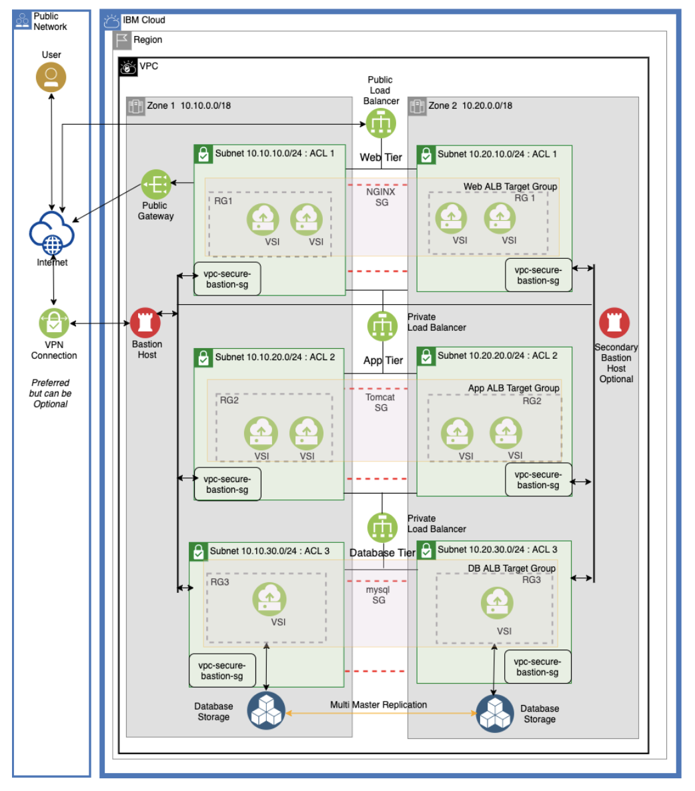

---

copyright:
  years:  2021
lastupdated: "2021-06-21"

keywords: migration, migrate, migrating, migrate data, data migration

subcollection: cloud-infrastructure

---

{:external: target="_blank" .external}
{:shortdesc: .shortdesc}
{:screen: .screen}
{:pre: .pre}
{:table: .aria-labeledby="caption"}
{:codeblock: .codeblock}
{:tip: .tip}
{:download: .download}
{:important: .important}
{:note: .note}
{:new_window: target="_blank"}
{:step: data-tutorial-type='step'}

# Components in a three-tier highly available architecture on an IBM Cloud VPC
{: #components-three-tier-architecture}

This tutorial covers the configuration of all the components of a three-tier architecture that includes the load balancers. It is for administrators who are creating three tier applications in IBM next-gen MZRs. Working knowledge of IBM Cloud VPC, Linux&reg; administration, three-tier applications like nginx, tomcat and mysql might be required. While it incorporates Nginx, Apache Tomcat and MySQL servers, it can be extended to any other components, such as Apache, PHP, and other database systems. The underlying infrastructure setup and layout will remain the same. The replication, configuration, and clustering components might change depending on the software you choose for your application.

## Overview
{: #overview-three-tier-2}

Whether you are running a mission critical application or a development and testing environment, having a backup plan to restore your systems promptly is crucial to increase productivity and reduce the impact to your business.

With a production system, you can’t afford downtime and must plan an HA and a DR strategy. You need to be able to bring your systems back up to business whether you experience a catastrophic failure or because of human error, and in the shortest possible time. In some cases, systems are dispensable and you can easily re-create them with scripts while in others, a few minutes to hours of downtime is acceptable.

Your strategy depends on:

*   Your business requirements
*   Available hardware and software redundancy
*   The geography and latency requirements of your busines application
*   Your financial affordability to implement such policy

The two main factors that are associated with HA architectures are RPO and RTO.

RPO, the Recovery Point Objective, refers to the amount of data loss that you can tolerate. The higher the frequency of your backups, the better your RPO.

RTO, the Recovery Time Objective, refers to the time required to bring the system back online after a failure or disaster occurs. The time taken to restore the files and roll forward (or backward) with transaction logs is your RTO.

You might need to design your HA strategy based on your RPO and RTO objectives. A more stringent RPO and RTO might also be cost prohibitive.

## Architecture diagram
{: #three-tier-arch-diagram}

This diagram shows the 3-tier architecture that you create with the tutorial[^master]. 

{: caption="Architectural Diagram"}

[^master]: While IBM values the use of inclusive language, terms that are outside of IBM's direct influence are sometimes required for the sake of maintaining user understanding. As other industry leaders join IBM in embracing the use of inclusive language, IBM will continue to update the documentation to reflect those changes.

## Components
{: #components-three-tier-2}

### Infrastructure Components
{: #three-tier-components}

**VPC, Zones, and Regions**

A VPC provides an enterprise with the ability to define and control a virtual network that is logically isolated from all other public cloud tenants. This isolation creates a private, secure place on the public cloud. All the components in this architecture are in a single VPC and Region. You might have up to three Zones in a region. In the interests of simplicity, two zones are considered in this tutorial. For more information on VPC, see [Virtual Private Cloud](https://www.ibm.com/cloud/learn/vpc){: external}.

**Subnets**

Three distinct subnets are created in each zone as shown in the architecture diagram. There are six private subnets in two zones; one subnet for each of the web, app, and database tiers in each zone.
For more information on subnets, see [About networking](https://cloud.ibm.com/docs/vpc?topic=vpc-about-networking-for-vpc).

**Bastion Host**

The bastion host provides access to private networked hosts. It’s a single point of entry to all virtual servers in the farm. A bastion host is a VSI (Virtual server Instance) that acts like a gateway to these servers. Administrative tasks on all the Virtual Server Instances are proxied through a bastion host. While a single bastion host in enough for day to day operations, you can optionally create a second bastion host in another zone for High Availability.

**NACLs and SG**

NACLs are permissions that are defined with inbound and outbound rules. Both inbound and outbound rules must be explicitly defined as NACLs are stateless. NACLs are applied at the subnet level and the rules apply to all the instances within the subnet. NACLs are the first level of protection at the subnet.

Security Groups are a bit more granular, and can be applied at the instance level, and are stateful. You can define a different set of rules to two different SGs and apply the SGs to two different instances running in the same subnet and with the same NACLs. Most of the rules and limits in this tutorial are applied through Security Groups.
For more information on VPC security groups, see [About security groups](https://cloud.ibm.com/docs/vpc?topic=vpc-using-security-groups).

**Load Balancers**

Load balancers distribute your traffic across multiple VMs, and you can scale your Virtual Server Instances up or down with minimal or no disruption of your traffic. You can Auto scale your servers as well. In the current architecture there are three load balancers: a public facing Load Balancer for the web servers, and a private load balancer each for both the app and database tiers. Application load balancers are configured in active-active mode. 
For more information on how ALB’s are configured see [About IBM Cloud Application Load Balancer for VPC](https://cloud.ibm.com/docs/vpc?topic=vpc-load-balancers).

**Ubuntu Linux&reg; Servers**

Ubuntu Linux&reg; servers 20.04 were used in the setup. Some of the commands that are listed might be different based on your operating system and its version.

### Software components

The following software is used in setting up the infrastructure.

1.  An Nginx web server with a public load balancer.
2.  Apache Tomcat server with a private load balancer.
3.  MySQL server with a Multi-Master[^master2] replication, and a private load balancer.

[^master2]:While IBM values the use of inclusive language, terms that are outside of IBM's direct influence are sometimes required for the sake of maintaining user understanding. As other industry leaders join IBM in embracing the use of inclusive language, IBM will continue to update the documentation to reflect those changes.

A multi master MySQL database is configured and is replicated between the zones. Refer to the diagram for details.
