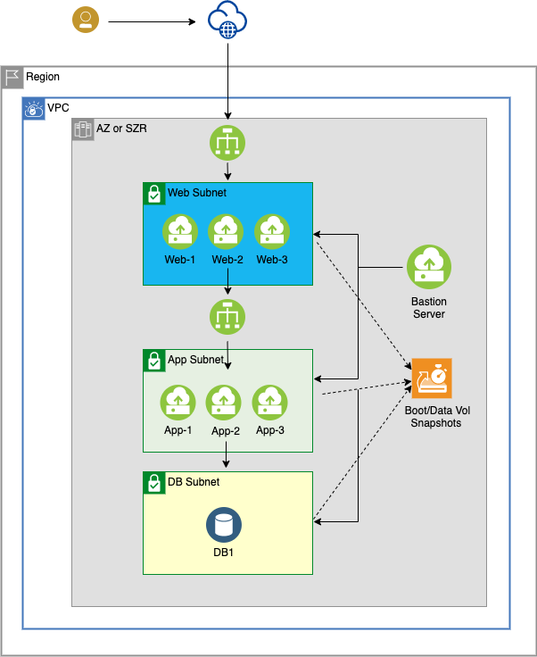

---

copyright: 
  years:  2021
lastupdated: "2021-12-14"

keywords: high availability, regions, zones, resiliency

content-type: tutorial

services: virtual-servers, vpc, loadbalancer-service

account-plan: paid

completion-time: 60m

subcollection: cloud-infrastructure

---

{:external: target="_blank" .external}
{:shortdesc: .shortdesc}
{:screen: .screen}
{:pre: .pre}
{:table: .aria-labeledby="caption"}
{:codeblock: .codeblock}
{:tip: .tip}
{:download: .download}
{:important: .important}
{:note: .note}
{:new_window: target="_blank"}
{:step: data-tutorial-type='step'}

# Deploying n-tier application with IBM Cloud single availability zone
{: #deploy-n-tier-app-szr}
{: toc-content-type="tutorial"} 
{: toc-services="virtual-servers, vpc, load balancer"} 
{: toc-completion-time="60m"}

This tutorial walks you through setting up a resilient environment for an n-tier application in an {{site.data.keyword.cloud}} for a single availability zone. The {{site.data.keyword.cloud_notm}} VPC infrastructure that is created uses Intel Xeon CPUs and additional Intel technologies. In this tutorial, you create your own VPC, then create subnets in one zone of the region, then you provision the virtual server instances.

## Objectives

*	Setting up resilient single availability zone VPC environment for the application
*	Setting up scheduling script for regular backups

## Architecture

{: caption="Architecture Diagram"}

1.	Provision 4 subnets (mgmt, web, app, and db)
2.	Provision security groups
3.	Provision placement groups for web and app
4.	Provision virtual server instances
    1.	Bastion server in mgmt subnet and generate an SSH Key
    2.	Provision virtual server instances in the corresponding tiers with security groups
5.	Deploy a public load balancer and a private load balancer between tiers in each of availability zones.
6.	Setup service IDs and deploy the script on the bastion server. For more information, see [Taking snapshot backups for your 3-Tier applications for SZR](/docs/cloud-infrastructure?topic=cloud-infrastructure-taking-snapshot-backups-for-your-3-tier-applications-for-szr).

## Before you begin

*	Check permissions for VPC
*	Generate SSH Keys from your workstation to connect to the bastion server

## Create a VPC
{: #deploy-n-tier-szr-vpc}
{: step}

To create your own IBM Cloud VPC in region 1, complete these steps:

1.	Go to the VPC overview page and click **Get Started**.
2.	Select **Create**.
3.	Under **New virtual private cloud** section: 
    1.	Enter ***vpc-some-application*** as the name for your VPC.
    2.	Select a **Resource group**.
    3.	Optionally, add **Tags** to organize your resources.
4.	Use the default access control list (ACL) (Allow all) for your VPC.
5.	Clear **Allow SSH** and **Allow ping** from the Default security group and leave classic access cleared. You add SSH access to the maintenance security group later. The maintenance security group must be added to an instance to allow SSH access from the bastion server. Ping access is not required for this tutorial.
6.	Leave **Create a default prefix for each zone** checked.
7.	Under **Subnets**: 
    1.  Select **Add subnet**.
    2.	Enter ***subnet-mgmt*** as your subnet's unique name.
    3.	Select a **Resource group**.
    4.	Select a zone, for example: Sydney 1. 
    5.	Select the wanted number of IP addresses.
    6.	Leave the access control list set to ***VPC default***. 
    7.	Leave the public gateway set to **Detached**. 
    8.  Select **Save**.
8.	Click **Create virtual private cloud**.

## Create subnets 
{: #deploy-n-tier-szr-subnets}
{: step}

You create three extra subnets for your first availability zone (vcp-region1-zone1) and use the VPC you created in Step 1:

*	subnet-web
*	subnet-app
*	subnet-db

To create the subnets:

1.	Click **Subnet**
2.	Click **Create**.
3.	Enter ***subnet-web*** as a unique name for your subnet.
4.	Select ***vpc-some-application*** as the VPC.
5.	Select a **Resource group**.
6.	Select a location and zone for example: Sydney and Sydney 1.
7.	Select the wanted number of IP addresses.
8.	Leave the **Subnet access control list** set to the default selection. 
9.	Leave the **Public gateway** to ***Detached***.
10.	Click **Create subnet**.
11.	Repeat steps 1-10 for the other two subnets and: 
    *	Create a subnet that is called ***subnet-app*** for application
    *	Create a subnet that is called ***subnet-db*** for db

To confirm that the subnets are created, click **Subnets** on the left panel and wait until the status changes to Available.

## Create security groups to control communications between VSIs
{: #deploy-n-tier-szr-sgs}
{: step}

To specify which traffic to allow to the application, you deploy rules, which you add to the virtual server instances in the later steps.
•	Enable an inbound rule for SSH traffic to bastion server
•	Enable specific ports for the corresponding application of each tier. For example, if the front-end server needs HTTPs, then a security group is needed to allow for 443. 

To create the security groups:

1.	Go to **Security groups**.
2.	Verify that the Regions setting is correct and if not then select the correct region, for example: Sydney
3.	Click **Create**.
4.	Create the security group ***bastion-sg***: 
    1.	Set the VCP to ***vpc-some-application***
    2.	Select your **Resource group**
    3.	Add one Inbound rule: Set **Protocol** to ***TCP***, **Port Min** and **Max** to ***22***, and **Source Type** to ***Any***.
    4.	Add one Outbound rule: Set **Protocol** to ***All*** and **Destination type** to ***Any***.
    5.  Click **Create security group**
5.  Click **Create**.
6.	Create the security group ***web-sg***:
    1.	Set the VPC to ***vpc-some-application***
    2.	Select your **Resource group**
    3.	Add two Inbound rules:
        *	Set **Protocol** to ***TCP***, **Port Min** and **Max** to ***22***, and **Source Type** to ***Any***.
        *	Set **Protocol** to ***TCP***, **Port Min** and **Max** to ***443***, and **Source Type** to ***Any***.
    4.	Add one Outbound rule: set the **Protocol** to ***All*** and **Destination type** to ***Any***. 
    5.  Click **Create security group**.
7.	Create security groups for ***app*** and ***db***. Use these guidelines:
    *  Allow SSH (port 22) for bastion access.
    *  If web access is required, then use HTTPS (port 443) for secure communication.
    *  Add any additional specific ports required for the respective tiers.
    *Avoid allowing all. Instead, create an allow list.

## Create placement groups
{: #deploy-n-tier-szr-placement}
{: step}

Placement groups guarantee the VSI are not created on the same hypervisor. For this example, we create placement groups with power spread. If you have more than 4 VSIs in a placement group, then you need to use hypervisor spread.

In addition to placement groups, consider using instance groups for cost optimization and scaling VSIs. Instance groups add and delete VSIs based on the current demand. So that you pay only for what you need. Placement groups also work with instance groups.
{: note}

1.	Go to **Placement groups**.
2.	Click **Create**.
3.	Enter ***web-group1*** as the placement group unique name.
4.	Select your **Resource group**.
5.	Select your **Region**.
6.	Select ***Power spread*** as your placement strategy.
7.	Click **Create placement group**.
8.	Repeat steps 2-7 for **app-group1**.

## Create virtual server instances
{: #deploy-n-tier-szr-vsi}
{: step}

You create multiple virtual server instances in different tiers for web, application, db. 
Provision Bastion virtual server instance

Use this task to provision the Bastion virtual server instance:

1.	Go to **Subnets**.
2.	Verify that the ***subnet-mgmt*** status is available.
3.	Click ***subnet-mgmt***.
4.	Click **Attached resources**.
5.	In Attached instances, click **Create**. 
6.	On the **New virtual server for VPC** page: 
    1.	Enter ***bastion-vsi*** as your virtual server's unique name.
    2.	Select the VPC your created earlier, the resource group and the Location, and the zone.
7.	Set the **Image** to ***Ubuntu Linux*** and pick any version of the image.
8.	Select **Memory** with ***2vCPUs*** and ***16 GB RAM*** as your profile. To check other available profiles, click **View all profiles**.
9.	Under **SSH keys**, click the SSH key that you created earlier. 
10.	Under **Network interfaces**, click the Edit icon next to the Security Groups. 
    1.	Verify ***subnet-mgmt*** is selected as the subnet.
    2.	Clear the preselected security group and choose ***bastion-sg***.
    3.	Click **Save**.
11.	Click **Create virtual server instance**.
12.	Go to the bastion virtual server instance on the IBM Cloud portal and attach a floating IP to the network interface.
13.	SSH to the bastion instance and create an ssh key.
14.	Upload the ssh key to the SSH keys for VPC to use later for web, app, and db virtual server instances.

### Provision virtual server instances for web and application

Use this task to provision virtual server instances. You repeat this task multiple times to provision virtual server instances for web, app, and db:

|Type|Use Subnet|Create Virtual server instance	|Placement Groups|
|----|----|----|----|
|web|subnet-web	|web-vsi1  /n web-vsi2  /n web-vsi3|web-group1|
|app|subnet-app	|app-vsi1  /n app-vsi2  /n app-vsi3|app-group1
|db	|subnet-db	|db-vsi1||

Use this task to provision virtual server instances for web: 

1.	Go to **Placement groups**.
2.	Click the actions menu for ***web-group1*** and select ***New instance***.
3.	On the **New virtual server for VPC** page: 
    1.	Enter ***web-vsi1*** as your virtual server's unique name.
    2.	Verify the VPC your created earlier, resource groups and the location, and the zone.
4.	Set the **Image** to ***Ubuntu Linux*** and pick any version of the image.
5.	Select **Compute** with ***2vCPUs*** and ***4 GB RAM*** as your profile. To check other available profiles, click **View all profiles**.
6.	Under SSH keys, select the SSH key that you created earlier.
7.  Under **Networking**, select the VPC you created for **Virtual Private Cloud**. 
8.	Under **Network interfaces**, click the Edit icon for Security Groups. 
    1.	Select ***subnet-web*** as the subnet.
    2.	Clear the default security group and check ***web-sg***.
    3.	Click **Save**.
9.	Click **Create virtual server instance**.
10.	Repeat steps 1-10 to provision the other 2 virtual servers. 
11.	Install necessary packages to support your front-end server such as php, node.js.

Use this task to provision virtual server instances for application:

1.	Go to **Placement groups**.
2.	Click the actions menu for ***app-group1*** and select ***New instance***.
3.	On the **New virtual server for VPC** page:
    1.	Enter ***app-vsi1*** as your virtual server's unique name.
    2.	Verify the VPC your created earlier, resource groups and the location, and the zone.
4.	Set the **Image** to ***Ubuntu Linux*** and pick any version of the image.
5.	Select **Memory** with ***2vCPUs*** and ***16 GB RAM*** as your profile. To check other available profiles, click **View all profiles**.
6.	Under **SSH keys**, select the SSH key that you created earlier.
7.  Under **Networking**, select the VPC you created. 
8.	Under **Network interfaces**, click the Edit icon for Security Groups.
    1.	Select ***subnet-app*** as the subnet.
    2.	Clear the default security group and check ***app-sg***. 
    3.	Click **Save**.
9.	Click **Create virtual server instance.**
10.	Repeat steps 1-8 to provision the others virtual server instances.
11.	Install the necessary packages to support your application server such as tomcat.

Use this task to provision virtual server instances for db:

1.	Go to **Subnets**.
2.	Verify that the subnet-db status is available.
3.	Click **subnet-db**.
4.	Click **Attached resources**. 
5.	In Attached instances, click **Create**. 
    1.	Enter ***db-vsi1*** as your virtual server's unique name.
    2.	Verify the VPC your created earlier, resource group and the location, and the zone.
6.	Set the **Image** to ***Ubuntu Linux*** and pick any version of the image.
7.	Select **Balanced** with ***4vCPUs 16 GB RAM*** as your profile or change to a different balanced profile that is more suitable for your application.
8.	Under **SSH keys**, select the SSH key that you created earlier.
9.  Leave **Add to instance placement group** cleared.  
10.	Under **Data Volumes**, click **Create** to add more volumes. 
    1.	These volumes are block volumes, so choose the appropriate size and IOPs that meet your db requirements.
    2.	Create as many volumes as needed.
11. Under **Networking** select the VPC that you created.  
12.	Under **Network interfaces**, click the Edit icon next to the Security Groups. 
    1.	Select ***subnet-db*** as the subnet.
    2.	Clear the default security group and check ***db-sg***. 
    3.	Click **Save**.
13.	Click **Create virtual server instance**.
14.	Install db applications such as NoSQL and tools. Enable the database vendor-provided data replication tool so the database is periodically replicated between the two.

## Distribute traffic between virtual server instances with load balancers
{: #deploy-n-tier-szr-lbs}
{: step}

You create two load balancers, one for ui and the other for application. {{site.data.keyword.cloud_notm}} load balancers. In this guide, we will use application load balancers.  The load balancers are resilient to avoid a single point of failure and can scale horizontally.

### Configure load balancers
1.	Go to **Load balancers** and click **Create**.
2.	Enter ***vpc-lb-web*** as the unique name, and select:
    1. 	**Application load balancer** as the load balancer. 
    2. 	The resource group. 
    3.	Select the Region, for example Sydney. 
    4.  Select the VPC that you created. 
    5.	Load balancer Type: Public.
3.	In Subnets, select ***subnet-web***.
4.	Click **New pool** to create a new back-end pool of virtual server instances that act as equal peers to share the traffic that is routed to the pool. Set the parameters with these values: 
    *	Name: web-pool
    *	Protocol: HTTPs
    *	Session stickiness: Source IP
    *	Proxy Protocol: - Depends on your configuration
    *	Method: Round robin 
    *	Health check path: /
    *	Health protocol: HTTPs
    *	Health port: Leave blank
    *	Interval(sec): 15
    *	Timeout(sec): 5
    *	Max retries: 2
5.	Click **Save**.
6.	Create a back-end pool: 
    1.	Click **Attach** to add server instances to the ***region1-pool***.
    2.	Add the **CIDR** range that is associated with ***subnet-web***, select the virtual server instance (***web-vsi1***) that you created and set **443** as the port. Repeat for the other virtual server instances. 
    3.	Click **Save** to complete the creation of a back-end pool.
7.	Click **New listener** and create a Front-end listener process that checks for connection requests: 
    *	Set the listener values:
        *	Protocol: HTTPs
        *	Port: 443
        *	Back-end pool: web-pool
        *	Max connections: Leave it empty 
    *	Click **Save**.
8.	Click **Create load balancer**.
9.	Repeat steps 1-8 to create the other load balancer for the application tier. Set the Type to Private and change to Port to the port applicable to the tier that is being serviced. 

## Next steps

After you set up your single zone application:

*  Configure snapshot backups for your application for SZR. For more information, see 
[Taking snapshot backups for your 3-Tier applications for SZR](/docs/cloud-infrastructure?topic=cloud-infrastructure-taking-snapshot-backups-for-your-3-tier-applications-for-szr).
*  Install the software packages that you want on your virtual server instances. The packages vary based on your solution. 

