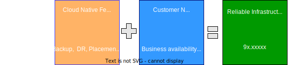
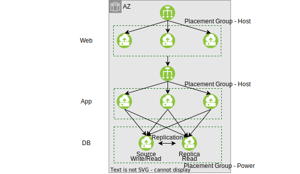
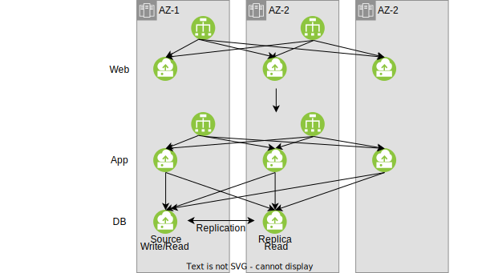
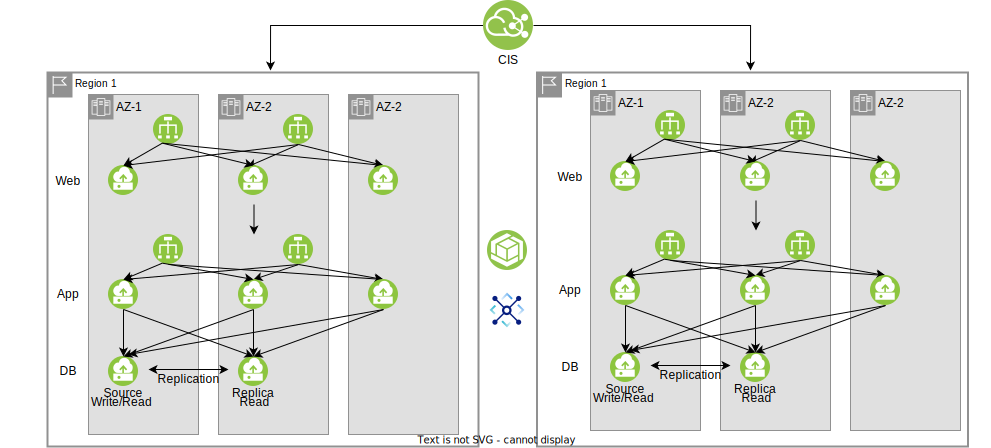
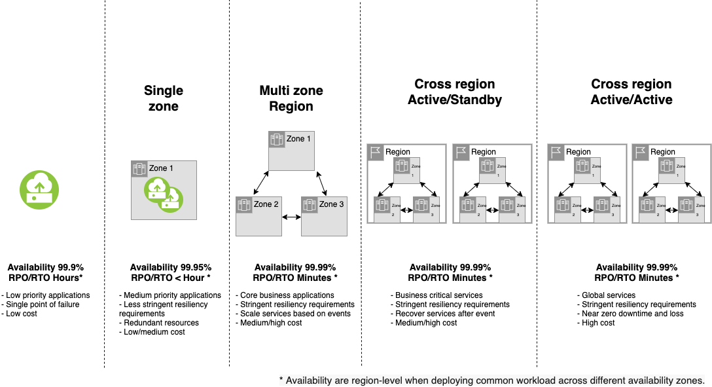
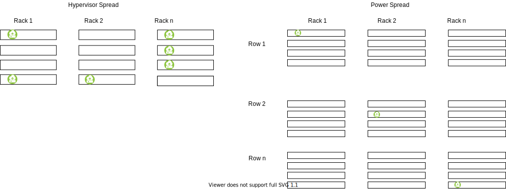

---

copyright: 
  years:  2021, 2022
lastupdated: "2022-04-12"

keywords: high availability, regions, zones, resiliency

services: virtual-servers, vpc, loadbalancer-service

account-plan: paid

subcollection: cloud-infrastructure

---

{:external: target="_blank" .external}
{:shortdesc: .shortdesc}
{:screen: .screen}
{:pre: .pre}
{:table: .aria-labeledby="caption"}
{:codeblock: .codeblock}
{:tip: .tip}
{:download: .download}
{:important: .important}
{:note: .note}
{:new_window: target="_blank"} 
{:step: data-tutorial-type='step'}

# High Availability and Resiliency on {{site.data.keyword.cloud_notm}}
{: #landing-about-ha-dr-backup}

With {{site.data.keyword.cloud}}, you can protect your critical workloads by building resilient highly available infrastructures. Using the backup, disaster recovery, and high availability features, you can minimize your downtime if a severe failure condition happens. You can safeguard your classic or VPC application with multiple availability zones or regions. By creating cloud infrastructures that are protected against a single point of failure, and backing up your data, you keep your workloads and web applications highly available. 
{: shortdesc} 

## What makes a cloud computing infrastructure resilient?
{: #landing-what-is-resilient}  

In {{site.data.keyword.cloud_notm}}, a resilient infrastructure keeps your cloud solution running at acceptable levels, even if one or more areas of the infrastructure experiences a minor or major problem:

* Power loss
* Planned or unplanned maintenance
* Hardware failure
* Network failure
* Natural disaster
* Ransomware

Resilient solutions are made up of multiple components. Different components can satisfy your business and technical requirements:

*  High Availability - System designs that provide continuous service, often by using redundant components to protect against failure. Redundancy is using multiple identical resources in different locations to protect against a single point of failure. 
*  Back up - Continuous backup of critical data for recovery to continue to provide service if key data is lost or inaccessible.
*  Disaster Recovery - Regaining access to the infrastructure after extreme events such as natural disasters, cyberattacks, or wide range power outages.

## {{site.data.keyword.cloud_notm}} and customer responsibilities
{: #landing-resiliency-responsibility}

{: caption="Figure 1. Building Resilient and Cost-Effective Infrastructure " caption-side="bottom"}

|IBM Cloud VPC infrastructure provides by design | Customer Selects|
|---------------|------------|
|- Protection against a single-point-of-failure  \n - Redundant power and high-speed connections  \n - Dual fans and network connections| - More features, such as anti-affinity and Auto scale  \n - Service offerings, such as LBaaS or VPN Gateways|

With {{site.data.keyword.cloud_notm}}, you have several methods to build resilient architectures to choose from:

* Standardized user interface that makes building custom infrastructures as simple as provisioning a server. 
* Terraform scripts that provide a CLI to automate your deployment consistently across different projects or locations. 
* Schematics workspaces that provide a user interface to customize and automate your deployment.

## Regions and availability zones
{: #landing-regions-zones}

{{site.data.keyword.cloud_notm}} data centers are in different geographical areas, countries, and regions. Each region has one or more availability zones, which are specific physical locations. Data centers can be single-zone, multi-zone region, or cross-multi-zone region.

### Single-zone 
{: #landing-single-zone}

An SZR provides redundant resources with low to medium cost. Use an SZR for medium level applications with less stringent resiliency requirements.

{: caption="Figure 2. Single-zone" caption-side="bottom"}

The single zone provides multiple VSIs for web, app, and db tiers in a single zone.

### Multi-zone region
{: #landing-multi-zone}

Use an MZR for core business applications that have stringent resiliency requirements. The MZR scales services based on events at a medium to high cost. 

An MZR provides these benefits:

*  Consistent cloud services across the different zones 
*  Better resiliency, availability, higher interconnect speed between data centers for cloud platforms
*  Infrastructure services such as IBM® Cloud Object Storage, and IBM Cloud load balancers 

{: caption="Figure 3. Multi-zone" caption-side="bottom"}

These features can be critical to your applications. Deploying the application in an MZR rather than a single zone can increase the availability from 3 9’s to 4 9’s when deployed over three zones.

### Cross-multi-zone
{: #landing-cross-multi-zone}

Use a cross-MZR for business critical or global services that have stringent resiliency requirements. In an Active/Standby configuration, your resources are available during a regional failure and you have a way to recover services after an event at a medium to high cost. In an Active/Active configuration, you have near zero downtime and loss at a higher cost.

Cross-multi-zone provides the benefits of a multi-zone arrangement across multiple zones.
{: caption="Figure 4. Cross-multi-zone" caption-side="bottom"}

## What levels of resiliency do the different zones and regions provide
{: #landing-levels-of-resiliency}

{: caption="Figure 5. Levels of Resiliency" caption-side="bottom"}

Whether the data centers are single-zone or multi-zone, all of them avoid a single-point-of-failure (SPOF) between zones and regions by providing:

* Multiple power feeds 
* Fiber links
* Dedicated generators
* Battery backup 

While all the data centers have multiple power feeds, several of the more mature sites have some 1U single socket server chassis that might not accommodate a dual power feed. If you have a 1U single socket server in one of these sites, you might want to consider a 2U chassis with redundant power supplies. For more information about availability zones, see [Locations for resource deployment](/docs/overview?topic=overview-locations).
{: note}

## Add on features for highly available compute resources
{: #landing-additional-features}

At a minimum, deploying more than one virtual server instance helps make your solution highly available. {{site.data.keyword.cloud_notm}} has more features that you can add to your solution:

* Placement groups that distribute your VSIs on different hypervisors or on different hypervisors with different power sources.
* Auto scale that aoutmtically scales your number of VSIs up and down based on capacity.

### Placement groups
{: #landing-placement-groups}

You can use [placement groups](/docs/vpc?topic=vpc-about-placement-groups-for-vpc) to ensure that multiple virtual server instances are on different physical servers within a data center or availability zone. Placing virtual server instances on different physical servers improves your overall redundancy and availability story. You can improve your redundancy more by spreading placement groups across different availability zones. Your business applications continue to run and provide service to your customers even if one or more virtual server instances are lost.

You have 2 different placement algorithms available to choose from:

*  Hypervisor spread - Ensures the VSIs are distributed across different hypervisors. There can be up to 12 VSIs in the placement group.
*  Power spread - Ensures the VSIs are placed not only different hypervisors but also the hypervisors are placed on different power and network, essentially on different racks. There can be up to 4 VSIs in the placement group.

{: caption="Figure 6. Placement group algorithms " caption-side="bottom"}

### Auto scale
{: #landing-auto-scale}

You can use [Auto scale](/docs/vpc?topic=vpc-creating-auto-scale-instance-group&interface=ui) to help optimize your compute costs. Auto scale adds and removes the virtual server instances dynamically to ensure you have the right amount of capacity for the current demand. You pay for what you need when you need it. The additional resources are removed when they are no longer needed. 

{: caption="Figure 7. Auto scale Compute adds virtual servers based on load" caption-side="bottom"}

## Using LBaaS to help increase resiliency
{: #landing-lbaas}

{{site.data.keyword.cloud_notm}} load balancer as a service (LBaaS) is a network offering that you can use to increase resiliency within a region. {{site.data.keyword.cloud_notm}} provides multiple network devices and connections to ensure that your servers and data storage components are always in contact with each other. When you spread your workload across multiple machines, consider using a load balancer. A load balancer provides a well-known destination to your application. It also provides redundancy and scaling.

For more information about the different types of LBaaS and capabilities, see [Load balancers for VPC overview](/docs/vpc?topic=vpc-nlb-vs-elb). To increase resiliency across regions, you can use the global load-balancing functions of [Cloud Internet Services (CIS)](/docs/cis?topic=cis-configure-glb).

## Using snapshot for backups
{: #landing-snapshot}

Some occurrences or events can put your business continuity at risk such as ransomware, data loss or corruption, accidental deletion, or catastrophic events. Make backup a part of your data resiliency plan to recover from these types of events. Backup is a point-in-time copy of your data from either your boot or data volumes. For more information about using {{site.data.keyword.cloud_notm}} snapshot backup capabilities, see [Creating Snapshots](/docs/vpc?topic=vpc-snapshots-vpc-create#snapshots-vpc-create).

## High Availability components and tutorials

For more information about High Availability solutions, see:

|Topic  |Links|
|-------|---|
|High Availability Reference Architecture solutions|- [High Availability infrastructure on IBM Classic](/docs/cloud-infrastructure?topic=cloud-infrastructure-ha-introduction)  \n - [Building a highly available 3-tier web application in VPC](https://test.cloud.ibm.com/docs/cloud-infrastructure?topic=cloud-infrastructure-components-three-tier-architecture)  \n - [Building a highly available 3-tier infrastructure in VPC](/docs/cloud-infrastructure?topic=cloud-infrastructure-ha-3-tier)|
|High Availability how-to solutions|- [Building highly available and scale wep application in classic](/docs/cloud-infrastructure?topic=solution-tutorials-highly-available-and-scalable-web-application)  \n - [Enabling Auto Scale for better capacity and resiliency](/docs/cloud-infrastructure?topic=cloud-infrastructure-ha-auto-scale)  \n - [Building blue green (A/B) deployment in VPC](/docs/cloud-infrastructure?topic=cloud-infrastructure-ha-pools-origins)  \n - [Deploying critical application in an MZR](/docs/cloud-infrastructure?topic=cloud-infrastructure-multi-zone-resiliency)|
|Backup  |- [Backup reference architecture for 3-tier web application in VPC](/docs/cloud-infrastructure?topic=cloud-infrastructure-regional-snapshots-3-tier-arch)  \n - [How-to guide for setting up snapshots for a 3-tier application in VPC](/docs/cloud-infrastructure?topic=cloud-infrastructure-create-three-tier-architecture)|
|Automating High Availability Solutions|- [Creating a resilient three-tier highly available infrastructure VPC with Terraform](/docs/cloud-infrastructure?topic=cloud-infrastructure-create-three-tier-resilient-vpc)  \n - [Creating a resilient three-tier highly available infrastructure VPC with Auto Scale by using Terraform](/docs/cloud-infrastructure?topic=cloud-infrastructure-create-three-tier-resilient-vpc-autoscale)|
