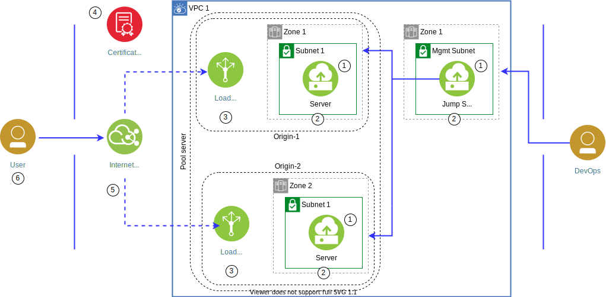

---

copyright:
  years: 2020
lastupdated: "2020-06-30"

keywords: high availability, regions, zones, resiliency

subcollection: overview

---

{:shortdesc: .shortdesc}
{:codeblock: .codeblock}
{:screen: .screen}
{:new_window: target="_blank"}
{:tip: .tip}
{:note: .note}
{:external: target="_blank" .external}
{:important: .important}
{:pre: .pre}

# Deploying server pools and origins in a single MZR
{: #ha-pools-origins}

Use this tutorial to deploy availability pools in a VPC for a single MZR. Creating server pools with origins provides your DevOps team with a staging environment so they can validate near-production ready code in parallel with an existing production environment.

This tutorial provides two use cases:
* Testing with new code in a production environment with minimal impact
* Creating A/B pools for testing

This tutorial uses a web server, which can provide a full stack within a single virtual server, you can also accomplish this using other types of 2- or 3-tier application stacks.

## Objectives:
{: #objectives}
* Create server pool and origins across availability zones
* Understand {{site.data.keyword.cis_full}} Global Load Balancer distribution algorithm

## Services used
{: #services}
* {{site.data.keyword.vpc_full}}
* {{site.data.keyword.vsi_is_full}}
* {{site.data.keyword.loadbalancer_full}}
* {{site.data.keyword.cis_full_notm}}

## Architecture
{: #architecture}
The following diagram depicts the architecture of this solution.

{:caption="Figure 1. Deploying server pools and origins in a single MZR" caption-side="bottom"}

The following steps refer to the numbers in the diagram:
1. DevOps provision 3 subnets:
  * Management (mgmt) subnet in AZ-1
  * Server subnet-1 in AZ-1
  * Server subnet-2 in AZ-2
1. DevOps provisions the virtual servers
  * Bastion server (jumphost) in mgmt subnet and generates an SSH Key
  * DevOps provisions the virtual server web servers in subnet-1 and subnet-2 with security groups
1.  DevOps deploys 2 {{site.data.keyword.Bluemix_notm}} {{site.data.keyword.loadbalancer_short}}, 1 in each AZs and pointing to the virtual server web servers in their respective zones.
1.  System admin enables HTTPS encryption by adding the domain SSL certificate to the certificate manager service.
1.  DevOps deploys a {{site.data.keyword.cis_short_notm}} instance with associated domain and create a global load balancer that points to each load balancer in each zone.
1.  Users can now make HTTP/HTTPS requests.

## Before you begin
{: #before-you-begin}
* Check the permissions for {{site.data.keyword.vpc_short}}. Your account needs to have permissions to create resources.
* Generate SSH Keys from your workstation to connect bastion server

## Create VPC, subnets, security groups, and virtual servers
{: #create-vpc}
In this section, you create your own VPC in region 1 with subnets that are created in two different zones of region 1. You will then provision the virtual servers.

To create your own {{site.data.keyword.vpc_short}} in region 1, complete the following steps:
1.  From the [VPC overview page](https://cloud.ibm.com/vpc/overview), Navigate to VPC overview page and click **Create a VPC for Gen 2**.
2.  Under New virtual private cloud section:
  * Enter _vpc-region1_ as the name for your VPC.
  * Select a Resource group.
  * Optionally, add Tags to organize your resources.
3.  Use the default access control list (**Allow all**).
4.  Disable **Allow SSH** and **Allow ping** from the Default security group. Enable **Enable access to classic resource**.
5.  Enable **Create a default prefix for each zone**.
6.  Under **New subnet for VPC**:
  * Type _vpc1-region1-zone1-mgmt_ as your subnet's unique name.
  * Select a **Resource group**.
  * Select a **Location** and zone **1**. For example, _Dallas_ and _Dallas 1_.
  * Select the number of IP addresses.
7.  Set **Subnet access control list** to **Use VPC default**.
8.  Set the **Public gateway** to **Detached**.
9. Click **Create virtual private cloud**.

### Create the other subnet for the web server in the same region
{: #other-subnets}
1.  Click **Subnet > New Subnet** and type _vpc-region1-zone1-subnet1_ as a unique name for your subnet.
1.  Select **vpc-region1** as the VPC.
1.  Select a **Resource group**.
2.  Select a zone **1** location. For example, _Dallas 1_.
3.  Select the numbered of IP addresses.
7.  Set **Subnet access control list** to **Use VPC default**.
8.  Set the **Public gateway** to **Detached**.
9.  Click **Create subnet**.

To confirm the creation of the subnets, click **Subnets** on the left pane and wait until the status changes to **Available**.

### Create subnet in a different zone for the other web server
{: #subnet-different-zone}
1.  Click **Subnet > New Subnet** and type _vpc-region1-zone2-subnet1_ as a unique name for your subnet.
1.  Select **vpc-region1** as the VPC.
1.  Select a **Resource group**.
2.  Select a zone **2** location. For example, _Dallas 2_.
3.  Select the numbered of IP addresses.
7.  Set **Subnet access control list** to **Use VPC default**.
8.  Set the **Public gateway** to **Detached**.
9.  Click **Create subnet**.

To confirm the creation of the subnet, click **Subnets** on the left pane and wait until the status changes to **Available**.

## Create two security groups
{: #security-groups}
These security groups will allow only specific inbound traffic to the server and application.

To specify which traffic to allow to the application, you deploy the following rules, which are added to virtual servers in the later steps.
1.  Navigate to **Security Groups**.
2.  Verify **Regions** is correct. For example, _Dallas_.
3.  Click **New security group**.
4.  Type _vpc-region1-jumphost-sg_ for **Name**.
5.  Create the following **Inbound** rules:
    * Protocol: TCP
    * Source Type: Any
    * Source: Any (0.0.0.0/0)
    * Value22
6. Create the **Outbound** rules as:
    * Protocol: Any
    * Destination: Any
1.  Navigate back to **Security Groups**.
2.  Verify **Regions** is correct. For example, _Dallas_.
3.  Click **New security group**.
4.  Type _vpc-region1-webserver-sg_ for **Name**.
5.  Create the following **Inbound** rules:

    <table>
     <tr>
       <th>Protocol</th>
       <th>Source Type</th>
       <th>Source</th>
       <th>Value</th>
     </tr>
     <tr>
       <td>TCP</td>
       <td>Any</td>
       <td>vpc-region1-jumphost-sg</td>
       <td>22</td>
     </tr>
     <tr>
       <td>TCP</td>
       <td>Any</td>
       <td>Any (0.0.0.0/0)</td>
       <td>80</td>
     </tr>
     <tr>
       <td>TCP</td>
       <td>Any</td>
       <td>Any (0.0.0.0/0)</td>
       <td>443</td>
     </tr>
    </table>

6.  Create the **Outbound** rules as:
    * Protocol: Any
    * Destination: Any

### Provision a bastion (jumphost) virtual server
{: #jumphost}
1.  Navigate to **Subnets**.
2.  Verify that the status is **Available**, then click **vpc-region1-zone1-mgmt > Attached resources > New instance**.
1.  Enter _jumphost-vsi_ as your virtual server's unique name.
2.  Select the VPC your created (_vpc-region1_), the **Resource group**, **Location**, and **Zone**.
3.  Set the image to _Ubuntu Linux_ and pick any version of the image.
4.  Select **Compute** with 2vCPUs and 4 GB RAM as your profile. To check other available profiles, click **All profiles**.
5.  Under **SSH keys** click **New key** to add the SSH key that you created in the [Before you begin](#before-you-begin) section.
6.  Under **Network interfaces**, click the Edit icon next to the **Security Groups**.
    * Verify  _region1-zone1-mgmt_ is selected as the subnet.
    * Disable the preselected security group and select _vpc-region1-jumphost-sg_.
    * Click **Save**.
7.  Click **Create virtual server instance**.
8.  Navigate to the jumphost virtual server on the {{site.data.keyword.Bluemix_notm}} console and switch the public gateway to **Attached**.
9.  Connect to the jumphost server by using SSH.
10. Create an SSH key on the jumphost server.
10. Copy the SSH key of the jumphost server. You use this key when you configure the web server virtual servers.

### Provision web server virtual servers
{: #webservers}
1.  Navigate to **Subnets**.
2.  Verify that the status is **Available**, then click **vpc-region1-zone1-mgmt > Attached resources > New instance**.
1.  Enter _vpc-region1-zone1-vsi_ as your virtual server's unique name.
2.  Select the VPC your created (_vpc-region1_), the **Resource group**, **Location**, and **Zone**.
3.  Set the image to _Ubuntu Linux_ and pick any version of the image.
4.  Select **Compute** with 2 vCPUs and 4 GB RAM as your profile. To check other available profiles, click **All profiles**.
5.  Under **SSH keys** click **New key** to add the SSH key that was created on _jumphost-vsi_.
6.  Under Network interfaces, click the Edit icon next to the Security Groups.
    * Select _vpc-region1-zone1-subnet_ as the subnet.
    * Disable the default security group and check _vpc-region1-webserver-sg_.
    * Click Save.
7.  Click **Create virtual server instance**.
8.  Repeat steps 1-7 to provision a virtual server in _vpc-region1-zone2-vsi_ in zone 2 of region 1.

### Install and configure web server on all virtual servers
{: #config-webservers}

After you successfully connect to the server in the subnet of zone 1 of region 1 by using SSH, complete the following steps to install and configure the Nginx web server.

Complete this procedure for each web server virtual server (vpc-region1-zone1-vsi, vpc-region1-zone2-vsi).
{: important}
1.  Open a command line, and run the following commands.

    ```sh
    sudo apt-get update
    ```
    {: pre}

    ```sh
    sudo apt-get install -y nginx
    ```
    {: pre}

1.  Check the status of the Nginx service.

    ```sh
    sudo systemctl status nginx
    ```
    {: pre}

    The output should show you that the Nginx service is active and running.
1.  Enable UFW.

    ```sh
    sudo ufw enable
    ```
    {: pre}

1.  Enable SSH.

    ```sh
    sudo ufw allow openssh
    ```
    {: pre}

1.  Enable nginx.

    ```sh
    sudo ufw allow 'nginx full'
    ```
    {: pre}

1.  Enable UFW.

    ```sh
    sudo ufw enable
    ```
    {: pre}

1.  Validate.

    ```sh
    sudo ufw staus verbose
    ```
    {: pre}

1.  Verify that port 22, 80, and 443 are allowed.
1.  Optionally verify that Nginx works as expected by using the command:

    ```sh
    curl localhost
    ```
    {: pre}

    If Nginx is working, you see default Nginx welcome page.
1.  Update the html page with the region and zone details.

    ```sh
    nano /var/www/html/index.nginx-debian.html
    ```
    {: pre}

1.  In the nginx welcome page, edit the h1 text to indicate that the server is running in zone 1 of region
1. Save your changes.
1.  Verify the changes.

    ```sh
    curl localhost
    ```
    {: pre}

## Distribute traffic between zones with load balancers
{: #lb}
In this section, you will create two load balancers, one in each region. This load balancer distributes traffic among multiple server instances to subnets within different zones.

### Configure load balancers
{: #lb-config}
1.  Navigate to [Load balancers](https://cloud.ibm.com/vpc/network/loadBalancers){: external} and click **New load balancer**.
2.  Type _vpc-lb-region1-zone1_ as the unique name
3.  Select _vpc-region1_ as your Virtual private cloud, select the **Resource group**, set **Region** as _region1_ and set **Type** to **Public**.
3.  Select _vpc-region1-zone1-subnet1_ for **Subnets**.
4.  Click **New pool** to create a new back-end pool of virtual servers that acts as equal peers to share the traffic routed to the pool. Set the parameters with the values below and click **Create**.
  * Name: region1-zone1-pool
  * Protocol: HTTP
  * Method: Round robin
  * Session stickiness: None
  * Health check path: /
  * Health protocol: HTTP
  * Health port: Leave blank
  * Interval(sec): 15
  * Timeout(sec): 5
  * Max retries: 2
5.  Click **Attach** to add server instances to the region1-pool.
  * Add the CIDR range that is associated with _vpc-region1-zone1-subnet_ and select the instance your created and set 80 as the port.
  * Click **Attach** to complete the creation of a back-end pool.
6.  Click **New listener** to create a new front-end listener. A listener is a process that checks for connection requests.
  * Protocol: HTTP
  * Port: 80
  * Back-end pool: region1-zone1-pool
  * Maxconnections: Leave it empty and click **Create**.
7.  Click **Create load balancer** to provision a load balancer.
8.  Repeat this procedure for the zone 2 load balancer.

You can configure the load balancers for HTTPS, refer to [Secure with HTTPS](/docs/vpc-on-classic?topic=solution-tutorials-vpc-multi-region#secure-with-https) to configure an SSL certificate and enable HTTPS.

### Test the load balancers
{: #lb-test}
Complete this procedure for each load balancer.
{: important}
1.  Wait until the status of the load balancer changes to **Active**.
2.  Click the **Hostname** to copy the hostname and open it in a web browser.
3.  Save the address for future reference.

## Provision a {{site.data.keyword.cis_full_notm}} instance and configure custom domain
{: #provision-cis}
In this section, you create an {{site.data.keyword.cis_full_notm}} instance, configure a custom domain by pointing it to {{site.data.keyword.cis_short_notm}} name servers and later configure a global load balancer.
1.  Navigate to the [IBM Cloud Internet Services](https://cloud.ibm.com/catalog/services/internet-services){: external} in the {{site.data.keyword.Bluemix_notm}} catalog.
2.  Enter a **Service name**, select a resource group, and click **Create** to provision an instance of the service. You can use any pricing plans for this tutorial.
3.  After the service instance is provisioned, set your domain name by clicking **Let's get started**, enter your domain name and click **Connect and continue**.
4.  Click **Next step**. When the name servers are assigned, configure your registrar or domain name provider to use the name servers listed. If you are using the {{site.data.keyword.Bluemix_notm}} domain service, see [Getting started with Domain Name Registration](/docs/dns?topic=dns-getting-started).
5.  After you've configured your registrar or the DNS provider, it might require up to 24 hours for the changes to take effect.
6. After the domain's status on the overview page changes from Pending to Active, use the `dig <mydomain.com> ns` command to verify that the new name servers have taken effect.

## Configure a global load balancer
{: #config-glb}
In this section, you configure a global load balancer (GLB) distributing the incoming traffic to the VPC load balancers configured in different {{site.data.keyword.Bluemix_notm}} regions.

### Distribute traffic across regions with a global load balancer
{: #distribute-glb}
1.  From the {{site.data.keyword.Bluemix_notm}} console, select **Resource list**.
1.  Expand **Services** and select the Internet Services you created.
1.  With the Internet Services instance open, select **Reliability > Global Load Balancers**.
1.  Click **Create load balancer**.
1.  Add `lb` to the **Balancer hostname**. The resulting fully qualified name would be `lb.mydomain.com`.
1. Set **Proxy** to **Off**.
1. Set **TTL** to **60 seconds**.
1.  Click **Add pool** to define a default origin pool.
1. For **Origin Pools**, select **Create New**. Set the following values:

    <table>
     <tr>
       <th>Field</th>
       <th>Value or action</th>
     </tr>
     <tr>
       <td>Name</td>
       <td>vpc-region1</td>
     </tr>
     <tr>
       <td>Health Check</td>
       <td>Create new<br>HTTP<br>Path: /<br>Port: 80</td>
     </tr>
     <tr>
       <td>Health Check Region</td>
       <td>Eastern North America</td>
     </tr>
     <tr>
       <td>Origins</td>
       <td>Name: Zone1<br>Address: fully qualified domain name (without http://)<br>Weight: 0.5<br>Click Add origin<br>Name: Zone2<br>Address: fully qualified domain name (without http://)<br>Weight: 0.5<br></td>
     </tr>
    </table>

1. Click **Add** to add the origin pool.
1. Click **Create** to create the Global Load Balancer.

Wait until the Health check status changes to **Healthy**. Open the URL of the load balancer: `lb.mydomain.com`.
