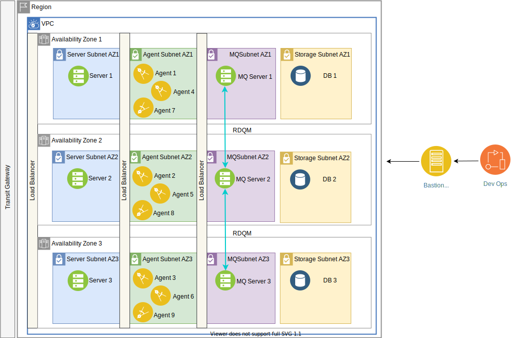

---

copyright:
  years: 2020
lastupdated: "2020-12-22"

keywords: high availability, regions, zones, resiliency
content-type: tutorial
services: virtual-servers, vpc, loadbalancer-service
account-plan: paid
completion-time: 45m
subcollection: cloud-infrastructure

---

{:shortdesc: .shortdesc}
{:codeblock: .codeblock}
{:screen: .screen}
{:new_window: target="_blank"}
{:tip: .tip}
{:note: .note}
{:external: target="_blank" .external}
{:step: data-tutorial-type='step'}

# Deploying critical applications with {{site.data.keyword.cloud_notm}} MZR
{: #multi-zone-resiliency}
{: toc-content-type="tutorial"} 
{: toc-services="virtual-servers, vpc, loadbalancer-service"} 
{: toc-completion-time="45m"}

This tutorial walks you through setting up the infrastructure layer for a resilient environment for a multitier application in a {{site.data.keyword.cloud}} MZR. In this tutorial, you create your own VPC in region 1, then create subnets in three different zones of region 1, then you provision the virtual server instances. You create three availability zones and virtual server instances in each availability zone for server, agent, mq, and db. 

While this tutorial is done with a 4-tier as discussed in the Resiliency in {{site.data.keyword.cloud_notm}} with MZR article, the same concept can be applied to a 3-tier application. 

## Objectives
{: #objectives-mzr}
* Setting resilient VPC environment for the application

## Architecture
{: #architecture-mzr}

{:caption="Figure 1. Resiliency across multiple zones in a region" caption-side="bottom"}

1.  Provision multiple subnets in each availability zone

    1.  AZ-1: server, agent, mq, and db 
    2.  AZ-2: server, agent, mq, and db
    3.  AZ-3: server, agent, mq, and db

2.  Provision virtual server instances

    1.  Bastion server (jumphost) in mgmt subnet and generates an SSH Key
    2.  Provision virtual server instances in the corresponding tiers with security groups

3.  Deploy load balancers between tiers in each of availability zone.

This tutorial tells you how to provision the infrastrtucture components only. RDQM and database replication are not covered in this tutorial. 

## Before you begin

* Check permissions for VPC
* Generate SSH Keys from your workstation to connect to the bastion server

## Create a VPC
{: #create-vpc-mzr}
{: step}

To create your own {{site.data.keyword.cloud_notm}} VPC in region 1, complete these steps:

1.	Go to the VPC overview page and click **Get Started**.
2.	Select **Create**.
3.	Under New virtual private cloud section: 
  *	Enter ***vpc-region1*** as the name for your VPC.
  *	Select a **Resource group**.
  *	Optionally, add **Tags** to organize your resources.
4.	The default access control list (ACL) (Allow all) is appropriate for your VPC.
5.	Clear **Allow SSH** and **Allow ping** from the Default security group and leave classic access cleared. You add SSH access to the maintenance security group later. The maintenance security group must be added to an instance to allow SSH access from the bastion server. Ping access is not required for this tutorial.
6.	Leave **Create a default prefix for each zone checked**.
7.	Under **New subnet for VPC**: 
  *	Enter ***vpc1-region1-zone1-mgmt*** as your subnet's unique name.
  *	Select a **Resource group**.
  *	Select a location and zone 1 for example: Dallas and Dallas 1.
  *	Select the wanted number of IP addresses.
8.	Leave the access control list set to **Use VPC default**.
9.	Leave the public gateway set to **Detached**. 
10.	Click **Create virtual private cloud**.

## Create subnets in the same availability zone of region 1
{: #create-subnets-mzr}
{: step}

### Create subnets in availability zone 1
{: #create-subnets-same-az}

You create four subnets for your first availability zone (vcp-region1-zone1) using the VPC you created in Step 1:
* vpc-region1-zone1-server
* vpc-region1-zone1-agent
* vpc-region1-zone1-mq
* vpc-region1-zone1-db

To create the subnets:

1.	Click **Subnet**
2.  Click **Create**.
3.  Enter ***vpc-region1-zone1-server*** as a unique name for your subnet.
4.  Select ***vpc-region1*** as the VPC.
5.  Select a Resource group.
6.	Select a location zone 1 for example: **Dallas 1**.
7.	Select the wanted numbered of IP addresses.
8.	Leave the subnet access control list to the default selection.
9.	Leave the public gateway to **Detached**.
10.	Click **Create subnet**.
11.	Repeat steps 1-10 for the other three subnets and:
    *	Create a subnet called ***vpc-region1-zone1-agent*** for agent
    *	Create a subnet called ***vpc-region1-zone1-mq*** for mq
    *	Create a subnet called ***vpc-region1-zone1-db*** for db

### Create subnets for availability zones 2 and 3
{: #create-subnets-other-az}

Use this task to create subnets for availability zones two and three.  You repeat the steps in this task multiple times to create seven subnets:

|Zone|Subnet|
|----|----|
|vpc-region1-zone2|vpc-region1-zone2-server vpc-region1-zone2-agent vpc-region1-zone2-mq vpc-region1-zone2-db|
|vpc-region1-zone3|vpc-region1-zone3-server vpc-region1-zone3-agent vpc-region1-zone3-mq vpc-region1-zone3-db|

To create the subnets: 

1.	Click **Create**. 
2.  Enter ***vpc-region1-zone2-server*** as a unique name for your subnet.
3.  Select ***vpc-region1*** as the VPC, and 
4.  Select a **Resource group**.
5.	Select a location for zone two for example: Dallas 2
6.	Select the wanted numbered of IP addresses.
7.	Leave the subnet access control list set to the default selection.
8.	Leave the public gateway set to **Detached**.
9.	Click **Create subnet**.
10.	Repeat steps 1-9 for availability zone 2:
    * Create a subnet called ***vpc-region1-zone2-agent*** 
    * Create a subnet called ***vpc-region1-zone2-mq***
    * Create a subnet called ***vpc-region1-zone2-db***

11.	Repeat steps 1-9 for availability zone 3:
    * Create a subnet called ***vpc-region1-zone3-server***
    * Create a subnet called ***vpc-region1-zone3-agent***
    * Create a subnet called ***vpc-region1-zone3-mq***
    * Create a subnet called ***vpc-region1-zone3-db***

To confirm that the subnets are created, click **Subnets** on the left pane and wait until the status changes to **Available**.
  
## Create two security groups to allow only specific inbound traffic to the server and application
{: #create-security-groups}
{: step}

To specify which traffic to allow to the application, you deploy rules, which you add to the virtual server instances in the later steps.
*	Enable inbound rule for SSH traffic to jumphost
*	Enable specific ports for the corresponding application of each tier. For example, if the front-end server needs HTTP and HTTPs, then security group is needed to allow for port 80 and 443. 

To create the security groups:

1.	Go to **Security Groups**.
2.	Verify that the Regions setting is correct and if not then select the correct region, for example: Dallas
3.  Click **Create**.
4.	Create the security group ***vpc-region1-jumphost-sg***: 

    1. Set the VCP to ***vpc-region1***
        
    2. Select your **Resource Group**

    3. Add one **Inbound rule**:  Set **Protocol** to ***TCP***, **Port Min and Max** to ***22***, and **Source Type** to ***Any***.

    4. Add one **Outbound rule**: Set **Protocol** to ***All*** and **Destination type** to ***Any***.

5. Create the security group ***vpc-region1-server-sg***:

    1. Set the VPC to ***vpc-region1***
        
    2. Select your **Resource Group**

    3. Add three **Inbound rules**:

        * Set **Protocol** to ***TCP***, **Port Min and Max** to ***22***, and **Source Type** to ***Any***.
        * Set **Protocol** to ***TCP***, **Port Min and Max** to ***80***, and **Source Type** to ***Any***.
        * Set **Protocol** to ***TCP***, **Port Min and Max** to ***443***, and **Source Type** to ***Any***.
  
    4. Add one Outbound rule: set the **Protocol** to ***All*** and **Destination type** to ***Any***.

6.	Create more security groups or access control rules and apply the security groups at each tier. A few of the recommendations are:
    * Avoid allowing all. Instead, create an allowlist and not a blocklist.
    * Use access control list to for subnet level (that is, agent subnet to allow server and mq only and not db).
    *	Use security group for specific host level security rules.

## Create virtual server instances
{: #create-vsis-mzr}
{: step}

You create mutiple virtual server instances in different availabiltiy zones for server, agent, mq, and db. 

### Provision Bastion (jumphost) virtual server instance
{: #bastion-vsi-mzr}

Use this task to provision the Bastion virtual server instance:

1.	Go to **Subnets**.
2.	Verify that the vpc-region1-zone1-mgmt status is available.
3.  Click **vpc-region1-zone1-mgmt**.
4.  Click **Attached resources**
5.  In **Attached instances**, click **Create**. 
6.  On the **New virtual server for VPC** page:
    1.	Enter ***jumphost-vsi*** as your virtual server's unique name.
    2.	Select the VPC your created earlier, the resource group and the Location, and zone.
6.	Set the image to ***Ubuntu Linux*** and pick any version of the image.
7.	Select ***Compute with 2vCPUs*** and ***4 GB RAM*** as your profile. To check other available profiles, click **View all profiles**.
8.	Under **SSH keys**, click the SSH key that you created earlier. 
9.	Under **Network interfaces**, click the Edit icon next to the **Security Groups**. 
    1.	Verify region1-zone1-mgmt is selected as the subnet.
    2.	Clear the preselected security group and choose ***vpc-region1-jumphost-sg***.
    3.	Click **Save**.
10.	Click **Create virtual server instance**.
11.	Go to the jumphost virtual server instance on the {{site.data.keyword.cloud_notm}} portal and switch the public gateway to attached.
12.	SSH to jumphost and create ssh key.
13.	Copy the ssh key for the web servers virtual server instances.

### Provision virtual server instances for the front-end server, agent, and mq
{: #other-vsi-mzr}

Use this task to provision virtual server instances for all of the availability zones. You repeat this task multiple times to provision  virtual server instancess for server, agent, and mq:

|Type|Use Subnet|Create Virtual server instance|
|----|----|----|
|server|vpc-region1-zone1-server vpc-region1-zone2-server vpc-region1-zone3-server|vpc-region1-zone1-server1 vpc-region1-zone2-server1 vpc-region1-zone3-server1|
|agent|vpc-region1-zone1-agent vpc-region1-zone2-agent vpc-region1-zone3-agent|vpc-region1-zone1-agent1 vpc-region1-zone2-agent1 vpc-region1-zone3-agent1|
|mq|vpc-region1-zone1-mq vpc-region1-zone2-mq vpc-region1-zone3-mq|vpc-region1-zone1-mq1 vpc-region1-zone2-mq1 vpc-region1-zone3-mq1|

1.	Go to **Subnets**.
2.	Verify that the vpc-region1-zone1-server status is available.
3.  Click **vpc-region1-zone1-server**.
4.  Click **Attached resources** 
5.  In **Attached instances**, click **Create**. 
6.  On the **New virtual server for VPC** page:   
    1.	Enter ***vpc-region1-zone1-server1*** as your virtual server's unique name.
    2.	Verify the VPC your created earlier, resource group and the Location, and zone.
7.	Set the image to ***Ubuntu Linux*** and pick any version of the image.
8.	Select ***Compute with 2vCPUs*** and ***4 GB RAM*** as your profile. To check other available profiles, click **View all profiles**.
9.	Under **SSH keys**, select the SSH key that you created earlier. Click **New key** to add a key.
10.	Under Network interfaces, click the Edit icon for **Security Groups**. 
    1.	Select ***vpc-region1-zone1-subnet*** as the subnet.
    2.	Clear the default security group and check ***vpc-region1-server-sg***.
    3.	Click **Save**.
11.	Click **Create virtual server instance**.
12.	Repeat steps 1-11 to provision a virtual server instance in the other availability zones:
    1. Create a virtual server instance for vpc-region1-zone2-server. 
    2. Create a virtual server instance for vpc-region1-zone3-server.
13.	Install necessary packages to support your front-end server such as php, node.js.

Repeat this task to create virtual server instances for agent:

  * Virtual server instance vpc-region1-zone1-agent1 in subnet vpc-region1-zone1-agent.  
  * Virtual server instance vpc-region1-zone2-agent1 in subnet vpc-region1-zone2-agent.  
  * Virtual server instance vpc-region1-zone3-agent1 in subnet vpc-region1-zone3-agent.  

Repeat this task to create virtual server instances for mq:

  * Virtual server instance vpc-region1-zone1-mq1 in subnet vpc-region1-zone1-mq.  
  * Virtual server instance vpc-region1-zone2-mq1 in subnet vpc-region1-zone2-mq.  
  * Virtual server instance vpc-region1-zone3-mq1 in subnet vpc-region1-zone3-mq.  

### Provision virtual server instances for db
{: #db-vsi-mzr}

Use this task to provision virtual server instances for db for availability zones one and three:

1.	Go to **Subnets**.
2.	Verify that the vpc-region1-zone1-db status is available.
3.  Click vpc-region1-zone1-db.
4.  Click **Attached resources**. 
5.  In **Attached instances**, click **Create**.  
    1.	Enter ***vpc-region1-zone1-db1*** as your virtual server's unique name.
    2.	Verify the VPC your created earlier, resource group and the Location, and zone.
6.	Set the image to ***Ubuntu Linux*** and pick any version of the image.
7.	Select ***Balanced with 4vCPUs*** and ***16 GB RAM*** as your profile or change to a different balanced profile that is more suitable for your application.
8.	Under **SSH keys**, select the SSH key that was created on jumphost-vsi.
9.	Under **Data Volumes**, click **Create** to add more volumes.
    1.	These volumes are block volumes, so choose the appropriate size and IOPs that meet your db requirements.
    2.	Create as many volumes as needed.
    3.	For snapshot and replication, you need to add a separate service either through the OS or db app.
10.	Under Network interfaces, click the Edit icon next to the **Security Groups**. 
    1.	Select ***vpc-region1-zone1-subnet*** as the subnet.
    2.	Clear the default security group and check ***vpc-region1-server-sg***.
    3.	Click **Save**.
11.	Click **Create virtual server instance**.

12. Repeat steps 1-11 to create virtual server instance for db for availability zone 2.

13. Repeat steps 1-11 to create virtual server instance for db for availability zone 3.

13.	Install necessary packages to support your front-end server.

## Distribute traffic between zones with load balancers
{: #load-balancers-mrz}
{: step}

You create three load balancers for front-end server, agent, and mq tiers. {{site.data.keyword.cloud_notm}} load balancers can service across multiple zones. The load balancers are resilient such to avoid a single point of failure and can scale horizontally due to load.

### Configure load balancers

1.	Go to **Load balancers** and click **Create**.
2.	Enter ***vpc-lb-region1*** as the unique name, select vpc-region1 as your Virtual private cloud, select the resource group, region1 as the region and Load balancer Type: Private.
3.	In **Subnets** select ***vpc-region1-zone1-server***.
4.	Click **New pool** to create a new back-end pool of virtual server instances that act as equal peers to share the traffic that is routed to the pool. Set the parameters with these values. 
    *	**Name**: region1-zone1-pool
    *	**Protocol**: HTTP
    *	**Session stickiness**: None
    *	**Method**: Round robin 
    *	**Health check path**: /
    *	**Health protocol**: HTTP
    *	**Health port**: Leave blank
    *	**Interval(sec)**: 15
    *	**Timeout(sec)**: 5
    *	**Max retries**: 2
5.  Click **Save**.
6.	Find the back-end pool that you created for region1-pool and:
    1.  Click **Attach** to add server instances to the region1-pool 
    2.	Select the instance that you created and set 80 as the port.
    3.	Click **Save** to complete the creation of a back-end pool.
7.	Click **New listener** and create a Front-end listener process that checks for connection requests: 

    1. Set the listener values:

        *	**Protocol**: HTTP
        *	**Port**: 80
        *	**Back-end pool**: region1-zone1-pool
        *	**Maxconnections**: Leave it empty 
        
    2.  Click **Save**.
8.  Click **Create load balancer**.

Repeat this task to create the other load balancers for the other tiers. Note, the port changes based on the tier it is servicing.

## Related information

For more information on {{site.data.keyword.cloud_notm}} Transit Gateway, see [Getting Started with {{site.data.keyword.cloud_notm}} Transit Gateway](/docs/transit-gateway?topic=transit-gateway-getting-started)

