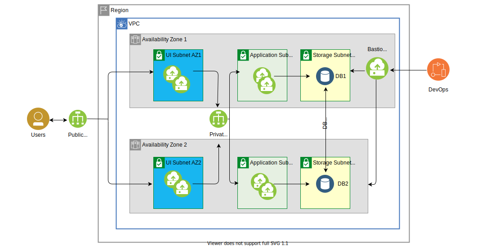

---

copyright:
  years: 2020, 2021
lastupdated: "2021-09-03"

keywords: high availability, regions, zones, resiliency
content-type: tutorial
services: virtual-servers, vpc, loadbalancer-service
account-plan: paid
completion-time: 45m
subcollection: cloud-infrastructure

---

{:shortdesc: .shortdesc}
{:codeblock: .codeblock}
{:screen: .screen}
{:new_window: target="_blank"}
{:tip: .tip}
{:note: .note}
{:external: target="_blank" .external}
{:step: data-tutorial-type='step'}

# Deploying critical applications with {{site.data.keyword.cloud_notm}} MZR
{: #multi-zone-resiliency}
{: toc-content-type="tutorial"} 
{: toc-services="virtual-servers, vpc, loadbalancer-service"} 
{: toc-completion-time="45m"}

This tutorial walks you through setting up a resilient environment for an n-tier application in an {{site.data.keyword.cloud}} MZR. In this tutorial, you create your own VPC in region 1, then create subnets in two different zones of region 1, then you provision the virtual server instances. You create two availability zones and virtual server instances in each availability zone for UI, application, and db. 

## Objectives
{: #objectives-mzr}
* Setting up resilient VPC environment for the application

## Architecture
{: #architecture-mzr}

{: caption="Figure 1. Resiliency across multiple zones in a region" caption-side="bottom"}

1.  Provision multiple subnets (UI, application, and db) in each availability zone

    1.  AZ-1: Mgmt, UI, application, and db 
    2.  AZ-2: UI, application, and db

2.  Provision Placement groups for ui application.

3.  Provision virtual server instances

    1.  Bastion server (jumphost) in mgmt subnet and generate an SSH Key
    2.  Provision virtual server instances in the corresponding tiers with security groups

4.  Deploy a public load balancer and a private load balancer between tiers in each of availability zones.

## Before you begin

* Check permissions for VPC
* Generate SSH Keys from your workstation to connect to the bastion server

## Create a VPC
{: #create-vpc-mzr}
{: step}

To create your own {{site.data.keyword.cloud_notm}} VPC in region 1, complete these steps:

1.	Go to the VPC overview page and click **Get Started**.
2.	Select **Create**.
3.	Under New virtual private cloud section: 
    *	Enter ***vpc-region1*** as the name for your VPC.
    *	Select a **Resource group**.
    *	Optionally, add **Tags** to organize your resources.
4.	The default access control list (ACL) (Allow all) is appropriate for your VPC.
5.	Clear **Allow SSH** and **Allow ping** from the Default security group and leave classic access cleared. You add SSH access to the maintenance security group later. The maintenance security group must be added to an instance to allow SSH access from the bastion server. Ping access is not required for this tutorial.
6.	Leave **Create a default prefix for each zone checked**.
7.	Under **New subnet for VPC**: 
    *	Enter ***vpc1-region1-zone1-mgmt*** as your subnet's unique name.
    *	Select a **Resource group**.
    *	Select a location and zone 1 for example: Dallas and Dallas 1.
    *	Select the wanted number of IP addresses.
8.	Leave the access control list set to **Use VPC default**.
9.	Leave the public gateway set to **Detached**. 
10.	Click **Create virtual private cloud**.

## Create subnets in the same availability zone of region 1
{: #create-subnets-mzr}
{: step}

### Create subnets in availability zone 1
{: #create-subnets-same-az}

You create three extra subnets for your first availability zone (VPC-region1-zone1) and use the VPC you created in Step 1:
* vpc-region1-zone1-ui
* vpc-region1-zone1-application
* vpc-region1-zone1-db

To create the subnets:

1.	Click **Subnet**
2.  Click **Create**.
3.  Enter ***vpc-region1-zone1-ui*** as a unique name for your subnet.
4.  Select ***vpc-region1*** as the VPC.
5.  Select a Resource group.
6.	Select a location zone 1 for example: **Dallas 1**.
7.	Select the wanted number of IP addresses.
8.	Leave the subnet access control list to the default selection.
9.	Leave the public gateway to **Detached**.
10.	Click **Create subnet**.
11.	Repeat steps 1-10 for the other two subnets and:
    *	Create a subnet that is called ***vpc-region1-zone1-app*** for application
    *	Create a subnet that is called ***vpc-region1-zone1-db1*** for db

### Create subnets for availability zone 2 
{: #create-subnets-other-az}

Use this task to create subnets for availability zones two and three. You repeat the steps in this task multiple times to create seven subnets:

|Zone|Subnet|
|----|----|
|vpc-region1-zone2|vpc-region1-zone2-ui vpc-region1-zone2-app vpc-region1-zone2-db1|

To create the subnets: 

1.  Enter ***vpc-region1-zone2-ui*** as a unique name for your subnet.
2.  Select ***vpc-region1*** as the VPC, and 
3.  Select a **Resource group**.
4.	Select a location for zone two for example: Dallas 2
5.	Select the wanted number of IP addresses.
6.	Leave the subnet access control list set to the default selection.
7.	Leave the public gateway set to **Detached**.
8.	Click **Create subnet**.
9.	Repeat steps 1-8 for availability zone 2:
    * Create a subnet that is called ***vpc-region1-zone2-app*** 
    * Create a subnet that is called ***vpc-region1-zone2-db1***

To confirm that the subnets are created, click **Subnets** on the left pane and wait until the status changes to **Available**.
  
## Create two security groups to allow only specific inbound traffic to the server and application
{: #create-security-groups}
{: step}

To specify which traffic to allow to the application, you deploy rules, which you add to the virtual server instances in the later steps.
*	Enable an inbound rule for SSH traffic to jumphost
*	Enable specific ports for the corresponding application of each tier. For example, if the front-end server needs HTTP and HTTPs, then a security group is needed to allow for port 80 and 443. 

To create the security groups:

1.	Go to **Security Groups**.
2.	Verify that the Regions setting is correct and if not then select the correct region, for example: Dallas
3.  Click **Create**.
4.	Create the security group ***vpc-region1-jumphost-sg***: 

    1. Set the VPC to ***vpc-region1***
        
    2. Select your **Resource Group**

    3. Add one **Inbound rule**:  Set **Protocol** to ***TCP***, **Port Min and Max** to ***22***, and **Source Type** to ***Any***.

    4. Add one **Outbound rule**: Set **Protocol** to ***All*** and **Destination type** to ***Any***.

5. Create the security group ***vpc-region1-ui-sg***:

    1. Set the VPC to ***vpc-region1***
        
    2. Select your **Resource Group**

    3. Add three **Inbound rules**:

        * Set **Protocol** to ***TCP***, **Port Min and Max** to ***22***, and **Source Type** to ***Any***.
        * Set **Protocol** to ***TCP***, **Port Min and Max** to ***80***, and **Source Type** to ***Any***.
        * Set **Protocol** to ***TCP***, **Port Min and Max** to ***443***, and **Source Type** to ***Any***.
  
    4. Add one Outbound rule: set the **Protocol** to ***All*** and **Destination type** to ***Any***.

6.	Create more security groups or access control rules and apply the security groups at each tier. A few of the recommendations are:
    * Avoid allowing all. Instead, create an allowlist and not a blocklist.
    * Use access control lists for subnet level (that is, application subnet to allow ui and db).
    * Use security groups for specific host level security rules.

## Create placement groups
{: #create-placement-groups}
{: step}

There are different approaches and strategies when it comes with placement groups.  You can create a placement group per zone, per tier, per stack and so forth.  For this example, create 2 placement groups, one placement group each for ui and application. The placement group spans the availability zones.

1. Go to **Placement groups**.
2. Click **Create**.
3. Enter ***web-group1*** as the placement group unique name.
4. Select your **Resource Group**.
5. Select your **Region**.
6. Select ***Host spread*** as your **Placement strategy**.
7. Click **Create placement group**.
8. Repeat steps 2-7 for app-group1.

## Create virtual server instances
{: #create-vsis-mzr}
{: step}

You create multiple virtual server instances in different availability zones for ui, application, db. 

### Provision Bastion (jumphost) virtual server instance
{: #bastion-vsi-mzr}

Use this task to provision the Bastion virtual server instance:

1.	Go to **Subnets**.
2.	Verify that the ***vpc-region1-zone1-mgmt*** status is available.
3.  Click **vpc-region1-zone1-mgmt**.
4.  Click **Attached resources**
5.  In **Attached instances**, click **Create**. 
6.  On the **New virtual server for VPC** page:
    1.	Enter ***jumphost-vsi*** as your virtual server's unique name.
    2.	Select the VPC your created earlier, the resource group and the Location, and the zone.
7.	Set the image to ***Ubuntu Linux*** and pick any version of the image.
8.	Select ***Memory with 2vCPUs*** and ***16 GB RAM*** as your profile. To check other available profiles, click **View all profiles**.
9.	Under **SSH keys**, click the SSH key that you created earlier. 
10.  Under **Networking** select the VPC that you created.
11.	Under **Network interfaces**, click the **Edit** icon next to the **Security Groups**. 
    1.	Verify ***region1-zone1-mgmt*** is selected as the subnet.
    2.	Clear the preselected security group and choose ***vpc-region1-jumphost-sg***.
    3.	Click **Save**.
12.	Click **Create virtual server instance**.
13.	Go to the jumphost virtual server instance on the {{site.data.keyword.cloud_notm}} portal and switch the public gateway to attached.
14.	SSH to the jumphost and create an ssh key.
15.	Upload the ssh key to the **SSH keys for VPC** to use later for ui, application, and db virtual server instances.

### Provision virtual server instances for ui and application
{: #other-vsi-mzr}

Use this task to provision virtual server instances for all of the availability zones. You repeat this task multiple times to provision virtual server instances for ui, application, and db:

|Type|Use Subnet|Create Virtual server instance|Placement group|
|----|----|----|----|
|ui|vpc-region1-zone1-ui|vpc-region1-zone1-ui1 vpc-region1-zone1-ui2|web-group1|
||vpc-region1-zone2-ui|vpc-region1-zone2-ui1 vpc-region1-zone2-ui2|web-group1|
|application|vpc-region1-zone1-app|vpc-region1-zone1-app1 vpc-region1-zone1-app2|app-group1|
||vpc-region1-zone2-app|vpc-region1-zone2-app1 vpc-region1-zone2-app2|app-group1|
|db|vpc-region1-zone1-db|vpc-region1-zone1-db1|
||vpc-region1-zone2-db|vpc-region1-zone2-db2|

**Virtual server instance for ui**

Use this task to provision virtual server instances for ui:

1. Go to **Placement groups**.
2. Click the actions button for ***web-group1*** and select **New** instance.
3. On the **New virtual server for VPC** page:
    1. Enter ***vpc-region1-zone1-ui1*** as your virtual server's unique name.
    2. Verify the VPC your created earlier, resource groups and the Location, and the zone.
4. Set the image to ***Ubuntu Linux*** and pick any version of the image.
5. Select ***Compute with 2vCPUs*** and ***4 GB RAM*** as your profile. To check other available profiles, click View all profiles.
6. Under **SSH keys**, select the SSH key that you created earlier.
7.  Under **Networking** select the VPC that you created.
8. Under **Network interfaces**, click the **Edit** icon for Security Groups.
    1. Select ***vpc-region1-zone1-ui*** as the subnet.
    2. Clear the default security group and check ***vpc-region1-ui-sg***. 
    3. Click **Save**.
9.  Click **Create virtual server instance**. 
10.  Repeat steps 1-8 to provision a second virtual server instance and for the other availability zones:
     1. Create another virtual server instance for the second ui (vpc-region1-zone1-ui2).
     2. Create two virtual server instances for zone 2 (vpc-region1-zone2-ui1 and vpc-region1-zone2-ui2).
11. Install necessary packages to support your front-end server such as php, node.js.

**Virtual server instance for app**

Use this task to provision virtual server instances for application:

1. Go to **Placement groups**.
2. Click the actions button for ***app-group1*** and select **New instance**.
3. On the **New virtual server for VPC** page:
    1. Enter ***vpc-region1-zone1-app1*** as your virtual server's unique name.
    2. Verify the VPC your created earlier, resource groups and the Location, and the zone.
4. Set the image to ***Ubuntu Linux*** and pick any version of the image.
18. Select ***Memory with 2vCPUs*** and ***16 GB RAM*** as your profile. To check other available profiles, click **View all profiles**.
5. Under **SSH keys**, select the SSH key that you created earlier.
6. Under **Networking** select the VPC that you created.
7. Under **Network interfaces**, click the **Edit** icon for **Security Groups**.
    1. Select ***vpc-region1-zone1-app1*** as the subnet.
    2. Clear the default security group and check ***vpc-region1-app-sgc***.
    3. Click **Save**.

8. Click **Create virtual server instance**.
9. Repeat steps 1-7 to provision a second virtual server instance and for the other availability zones:
    1. Create another virtual server instance for the second app (vpc-region1-zone1-app2).
    2. Create two virtual server instances for zone 2 (vpc-region1-zone2-app1 and vpc-region1-zone2-app2).
10. Install the necessary packages to support your application server such as tomcat.

Use this task to provision virtual server instances for db:

1.	Go to **Subnets**.
2.	Verify that the vpc-region1-zone1-db status is available.
3.  Click **vpc-region1-zone1-db**.
4.  Click **Attached resources**. 
5.  In **Attached instances**, click **Create**.  
    1.	Enter ***vpc-region1-zone1-db1*** as your virtual server's unique name.
    2.	Verify the VPC your created earlier, resource group and the Location, and the zone.
6.	Set the image to ***Ubuntu Linux*** and pick any version of the image.
7.	Select ***Balanced*** with ***4vCPUs*** and ***16 GB RAM*** as your profile or change to a different balanced profile that is more suitable for your application.
8.	Under **SSH keys**, select the (bastion) SSH key that was created on jumphost-vsi.
9.  Under **Networking** select the VPC that you created.
10.	Under **Data Volumes**, click **Create** to add more volumes.
    1.	These volumes are block volumes, so choose the appropriate size and IOPs that meet your db requirements.
    2.	Create as many volumes as needed.
11.	Under **Network interfaces**, click the **Edit** icon next to the **Security Groups**. 
    1.	Select ***vpc-region1-zone1-db*** as the subnet.
    2.	Clear the default security group and check ***vpc-region1-db-sg***.
    3.	Click **Save**.
12.	Click **Create virtual server instance**.
13. Repeat steps 1-11 to create a virtual server instance for db for availability zone 2, and call the VPC ***vpc-region1-zone2-db2***.
14.	Install db applications such as NoSQL and tools. Enable the database vendor-provided data replication tool so the database is periodically replicated between the two.

## Distribute traffic between zones with load balancers
{: #load-balancers-mrz}
{: step}

You create two load balancers for ui and application. {{site.data.keyword.cloud_notm}} load balancers can service across multiple zones. The load balancers are resilient to avoid a single point of failure and can scale horizontally due to load.

### Configure load balancers

1.	Go to **Load balancers** and click **Create**.
2.	Enter ***vpc-lb-ui*** as the unique name, and select:
    *  **vpc-region1** as your Virtual private cloud. 
    *  **Application load balancer** as the load balancer. 
    *  The resource group. 
    *  region1 as the region. 
    *  Load balancer Type: **Public**.

3.	In **Subnets**, select **vpc-region1-zone1-ui** and **vpc-region1-zone2-ui**.
4.	Click **New pool** to create a new back-end pool of virtual server instances that act as equal peers to share the traffic that is routed to the pool. Set the parameters with these values: 
    *	**Name**: region1-zone1-pool
    *	**Protocol**: HTTP
    *	**Session stickiness**: Source IP
    *   **Proxy Protocol**: - Depends
    *	**Method**: Round robin 
    *	**Health check path**: /
    *	**Health protocol**: HTTP
    *	**Health port**: Leave blank
    *	**Interval(sec)**: 15
    *	**Timeout(sec)**: 5
    *	**Max retries**: 2
5.  Click **Save**.
6.	Create a back-end pool:
    1. Click **Attach** to add server instances to the region1-pool.
    2. Add the CIDR range that is associated with **vpc-region1-zone1-ui**, select the virtual server instance (vpc-region1-zone1-ui1) that you created and set 80 as the port. Repeat for the other virtual server instance, vpc-region1-zone1-ui2.
    3.	Click **Save** to complete the creation of a back-end pool.
7.	Click **New listener** and create a Front-end listener process that checks for connection requests: 

    1. Set the listener values:

        *	**Protocol**: HTTP
        *	**Port**: 80
        *	**Back-end pool**: region1-zone1-pool
        *	**Max connections**: Leave it empty 
        
    2.  Click **Save**.
8.  Click **Create load balancer**.
9.  Repeat steps 1-8 to create the other load balancer for the application tier. Set the **Type** to **Private** and change to **Port** to the port applicable to the tier that is being serviced. 

