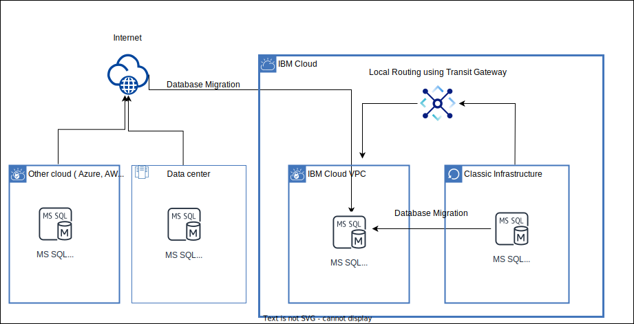
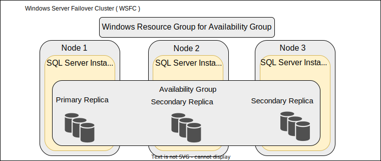

---

copyright:
  years:  2022, 2024
lastupdated: "2024-10-09"

subcollection: cloud-infrastructure

---

{{site.data.keyword.attribute-definition-list}}

# Microsoft SQL Server database migration
{: #mssql-db-overview}

Database migration is defined as moving a database to and from the database server. You can migrate your Microsoft&reg; SQL Server database between servers or instances in various ways. You might want to move a single database, multiple databases, logins, or stored procedures and views. You can use any of the following methods or combinations of methods to migrate Microsoft&reg; SQL Server databases.

## Why migrate?
{: #why-migrate}

1. Moving to an entirely new server.
2. Moving to a different instance of SQL.
3. Restoring databases from a backup.
4. Creating a development server or going live to a production server.
5. Versioning - A specific database or its version has features that offer more benefits than their existing database or its version.

## Migration overview diagram
{: #mssql-db-overview-diagram}

{: caption="Migration overview diagram" caption-side="bottom"}

## Use cases
{: #use-cases}

1. On-premises to {{site.data.keyword.vpc_short}}.
2. Other cloud service providers to {{site.data.keyword.vpc_short}}.
3. {{site.data.keyword.cloud_notm}} classic bare metal or virtual server instance to {{site.data.keyword.vpc_short}}.

## Prerequisites
{: #mssql-db-prerequisites}

Before you begin your Microsoft&reg; SQL Server database migration, review and complete the following prerequisites:

1. Conduct an inventory of the databases that needs to be migrated.
2. Assess the databases for potential migration issues or blockers, and then resolve any items that you uncovered.
3. Ensure that enough disk space is available for the target server of the new database.
4. Ensure that the user has appropriate rights or permissions to perform migration activity.
5. SQL Server Management Studio needs to be installed on each server for few methods.
6. Define a plan for the migration.
7. Back up all the data.

## Migration considerations
{: #mssql-db-migration-consideration}

* Migrating a server during nonpeak times.
* Choosing the right migration strategy.
* Reducing complexity by migrating the database in a phased approach instead of a single step.

For more information, see [Migration considerations](/docs/microsoft?topic=microsoft-mssql-migration).

## Migration methods
{: #mssql-db-migration-methods}

| Migration tools and solutions | Use cases |
| ----------------- | -------- |
| [RackWare Management Module (RMM)](/docs/cloud-infrastructure?topic=cloud-infrastructure-mssql-db-overview#rackware-management-module) | Database on single server or clustered database on multiple servers. For a Microsoft SQL server clustered database migration, user needs to take care of licenses, shared disk configuration, updating the correct IP address in DNS records of DNS / active directory server, setting up DNS server for all node servers. {: note} |
| [Backup and restore with Windows&reg; {{site.data.keyword.backup_notm}} Agent](/docs/cloud-infrastructure?topic=cloud-infrastructure-mssql-db-overview#backup-and-restore-backup-agent) | Large data migration, full database backup, moving database data to another drive, moving database data between different versions of SQL server. |
| [Detach and attach](/docs/cloud-infrastructure?topic=cloud-infrastructure-mssql-db-overview#detach-and-attach) | Full database backup, moving database data to another drive, moving database data between different versions of SQL server. |
| [Import and export data from SQL Server](/docs/cloud-infrastructure?topic=cloud-infrastructure-mssql-db-overview#import-and-export) | Large data migration, full database backup |
| [Copy Database Wizard](/docs/cloud-infrastructure?topic=cloud-infrastructure-mssql-db-overview#copy-database-wizard) | Small data migration |
| [Generate a script](/docs/cloud-infrastructure?topic=cloud-infrastructure-mssql-db-overview#generate-script) | Small data migration or schema-only migration |
| [Backup and restore with SQL Server Management Studio](/docs/cloud-infrastructure?topic=cloud-infrastructure-mssql-db-overview#backup-and-restore-management-studio) | Large data migration, full database backup, moving database data to another drive, moving database data between different versions of SQL server. |
| [Transactional replication](/docs/cloud-infrastructure?topic=cloud-infrastructure-mssql-db-overview#transaction-replication)| Copying and distributing data and database objects from one database to another, synchronizing between databases to maintain consistency. |
| [Database mirroring](/docs/cloud-infrastructure?topic=cloud-infrastructure-mssql-db-overview#database-mirroring)| Copying or mirroring of an SQL Server database on a standby server. |
| [Always On availability groups](/docs/cloud-infrastructure?topic=cloud-infrastructure-mssql-db-overview#always-on-availability-groups) | Large data migration |
| [Always On distributed availability groups](/docs/cloud-infrastructure?topic=cloud-infrastructure-mssql-db-overview#always-on-distributed-availability-groups) | Large data migration |
| [Data Migration Assistant (DMA)](/docs/cloud-infrastructure?topic=cloud-infrastructure-mssql-db-overview#data-migration-assistant) | Large data migration, migration assessment, server upgrade |
| [Smart Bulk Copy](/docs/cloud-infrastructure?topic=cloud-infrastructure-mssql-db-overview#smart-bulk-copy) | Large data migration, other cloud service providers to {{site.data.keyword.vpc_short}}, on-premises to {{site.data.keyword.vpc_short}}. |
{: caption="Migration methods and use cases" caption-side="bottom"}

### RackWare Management Module (RMM)
{: #rackware-management-module}

RackWare Management Module (RMM) is a simple workload migration solution that is provided by IBM’s partner RackWare. RMM provides an automated, and convenient process to migrate existing compute workloads to {{site.data.keyword.cloud_notm}}. It tracks data changes on the source server until cutover, and performs delta syncs to the target server in {{site.data.keyword.cloud_notm}}. This tool migrates a server with everything on it including the operating system, along with its installed database application and data (lift and shift migration). RMM can do database migration if it is a platform-based database (for example, it can access database workloads with a public IP address). For more information, see [On-premises VMware VM to {{site.data.keyword.vpc_short}} migration with RMM](/docs/cloud-infrastructure?topic=cloud-infrastructure-migrating-images-vmware-vpc).

RMM can migrate single MSSQL database or clustered databases. The following things must be considered after migration:

* Licenses for database applications on target servers.
* Update DNS records with correct IP addresses on/for target servers.
* Configured shared disk on the target side.
* Ensure all the configuration of the cluster is correct and all services are up and running correctly.
* **Known issue:**
   When migration is performed for servers with clustered node "the trust relationship between this workstation and the primary domain failed". So even if you enter the correct domain credentials post migration, it does not allow to user to log in.
* **Workaround:**
   A simple solution to this problem is to log in to the node by using local admin account and explicitly unjoin node machine from domain and rejoin domain. After the server rejoined the domain, log in to the target machine by using domain credentials. This process is automated in the form of a script. To download and use this script, see this [public GitHub repository](https://github.com/IBM-Cloud/vpc-migration-tools/tree/main/db-migration/mssql/post-migration/){: external}.

The RMM tool does not support migration of Amazon Relational Database Service (AWS RDS) or similar databases.
{: note}

This tool can be found in the {{site.data.keyword.cloud_notm}} catalog as [RackWare - CloudMotion](/catalog/content/IBM-MarketPlace-P2P-1.3-22935832-bd76-49ab-b53e-12fc5d04c266-global?catalog_query=aHR0cHM6Ly9jbG91ZC5pYm0uY29tL2NhdGFsb2c%2Fc2VhcmNoPVJhY2tXYXJlI3NlYXJjaF9yZXN1bHRz){: external}.

### Backup and restore with Windows® IBM Cloud® Backup Agent
{: #backup-and-restore-backup-agent}

To protect Microsoft&reg; SQL Server databases, you can install the SQL Server plug-in with the Windows&reg; {{site.data.keyword.backup_notm}} Agent on the server where the SQL Server is running. Then, you can add and run backup jobs that specify which SQL Server databases to back up and where to save the backup data. After you back up the SQL Server databases by using the SQL Server plug-in, you can restore databases directly to an SQL Server instance, or restore databases to flat files. For more information, see [Configuring MSSQL database backups](/docs/Backup?topic=Backup-configureMSSQLBackup) and [Restoring MSSQL Database](/docs/Backup?topic=Backup-restoreMSSQLDB).

### Detach and attach
{: #detach-and-attach}

The data and transaction log files of a database can be detached and then reattached to the same or another instance of SQL Server. Detaching and attaching a database is useful if you want to change the database to a different instance of SQL Server on the same computer or move the database on a different computer. You can use this feature of the SQL Server Management Studio tool to copy, move, or upgrade an SQL Server database. For more information, see [Detach a database](https://learn.microsoft.com/en-us/sql/relational-databases/databases/detach-a-database?view=sql-server-ver15){: external} and [Attach a database](https://learn.microsoft.com/en-us/sql/relational-databases/databases/attach-a-database?view=sql-server-ver15){: external}.

### Import and export data from SQL Server
{: #import-and-export}

You can use various methods to import data to, and export data from, the SQL Server. You can also import and export data in various data formats. These formats include flat files, excel, major relational databases, and various cloud services. For more information, see [Import and export data from SQL Server](https://learn.microsoft.com/en-us/sql/relational-databases/import-export/overview-import-export?view=sql-server-ver15){: external}.

### Copy Database Wizard
{: #copy-database-wizard}

The Copy Database Wizard moves or copies databases and certain server objects easily from one instance of the SQL Server to another instance, with no server downtime. For more information, see [Use the Copy Database Wizard](https://learn.microsoft.com/en-us/sql/relational-databases/databases/use-the-copy-database-wizard?view=sql-server-ver15){: external}.

### Generate a script
{: #generate-script}

The generate script wizard generates a script of all the objects in a database or a subset of the objects that are selected, and you can decide whether you want to include permissions, collation, constraints, and so on. The generated scripts can be run on another instance of the database engine or the SQL Server database. This method is used to copy schema as well as data. It's not ideal if you are copying data for large databases. For more information, see [Generate Scripts (SQL Server Management Studio)](https://learn.microsoft.com/en-us/sql/ssms/scripting/generate-scripts-sql-server-management-studio?view=sql-server-ver15){: external}.

### Backup and restore with SQL Server Management Studio
{: #backup-and-restore-management-studio}

A backup of SQL Server data is created at the level of a database or one or more of its files or filegroups. You can create a full database backup in the SQL Server by using SQL Server Management Studio. Table-level backups cannot be created. For more information, see [Backup and restore with SQL Server Management Studio](https://learn.microsoft.com/en-us/sql/relational-databases/backup-restore/quickstart-backup-restore-database?view=sql-server-ver15){: external}. 

### Transactional replication
{: #transaction-replication}

Transactional replication is a method for copying and distributing data and database objects from one database to another and then synchronizing between databases to maintain consistency. It enables changes to be transferred between one database and another, which includes data, tables, stored procedures, views, and so on. Transactional replication is typically used in database clustering or server-to-server environments and is used for high availability of database and high throughput. However, this method can be used for database migration. For more information, see [Transactional replication](/docs/microsoft?topic=microsoft-mssql-migration#mssql-migration-rep).

### Database mirroring
{: #database-mirroring}

Database mirroring in SQL Server allows you to keep a copy, or mirror, of an SQL Server database on a standby server. Mirroring ensures two separate copies of the data always exist, providing high availability and complete data redundancy. This method is usually used for increased availability of a database, as well as during production database upgrades. This method can also be used for database migration. For more information, see [Database mirroring](/docs/microsoft?topic=microsoft-mssql-migration#mssql-migration-mirror).

### Always On availability groups
{: #always-on-availability-groups}

SQL Server Always On availability groups provide high availability and disaster recovery solutions and are available in versions of SQL Server 2012 and newer. This feature can be used to migrate your existing SQL Server databases to {{site.data.keyword.cloud_notm}} with minimal downtime. If you have an existing Windows® Server Failover Cluster with Always On availability groups, you are able to extend the cluster temporarily during migration by creating an extra secondary replica with asynchronous replication. During a maintenance window, a manual failover can be performed to enable the cut-over. Always On availability groups provide high availability, disaster recovery, and read-scale balancing. These availability groups require a cluster manager. In Windows®, the failover clustering feature provides the cluster manager. For more information, see [What is an Always On availability group?](https://learn.microsoft.com/en-us/sql/database-engine/availability-groups/windows/overview-of-always-on-availability-groups-sql-server?view=sql-server-ver15){: external}.

{: caption="Always On availability group" caption-side="bottom"}

### Always On distributed availability groups
{: #always-on-distributed-availability-groups}

An SQL Server Always On distributed availability group spans two distinct availability groups. Each availability group is configured on two different Windows® Server Failover Clusters (WSFC), one at the source location and one in {{site.data.keyword.vpc_short}}. The operating systems and SQL Server versions do not have to be the same version if they are able to support WSFC and availability groups. This migration method is suited to rehost mission-critical SQL Server databases. For more information, see [Always On distributed availability groups](/docs/microsoft?topic=microsoft-mssql-migration#mssql-migration-dag).

### Data Migration Assistant (DMA)
{: #data-migration-assistant}

Data Migration Assistant is a database assessment and migration tool that is provided by Microsoft®. It finds database compatibility issues and feature parity in terms of database assessment. It is used mainly to check the compatibility issues that might affect the database functions when you migrate databases to a new SQL Server. The Data Migration Assistant provides you with the ability to configure the number of databases to migrate in parallel. For more information, see [Overview of Data Migration Assistant](https://learn.microsoft.com/en-us/sql/dma/dma-overview?view=sql-server-ver15){: external}.

### Smart Bulk Copy
{: #smart-bulk-copy}

The Smart Bulk Copy tool is used to move data from one SQL Server database to another. It uses physical partitions and parallel copy tasks for faster transfer of data. It can also be used to move data from two instances of SQL Server running in two different cloud providers or to move from on-premises to the cloud. This method is suitable for large-size data migration. For more information, see [Smart Bulk Copy](https://learn.microsoft.com/en-us/samples/azure-samples/smartbulkcopy/smart-bulk-copy/){: external}.

## Set up target on {{site.data.keyword.vpc_short}}
{: #mssql-db-setup-target}

You need to set up a target Microsoft&reg; SQL Server instance per your requirement. For more information, see [About Microsoft&reg; SQL on VPC](/docs/microsoft?topic=microsoft-mssql-about).

## Post migration
{: #mssql-db-post-migration}

Review the following post-migration tasks:

* Compare source database size with target database size.
* Sample test for table data.
* Sample test for indexes or column constraints.
* Sample test for triggers, stored procedures, views.
* Make sure that the application configuration is updated to consume new database and test the application.
* Apply licenses to SQL Server databases.
