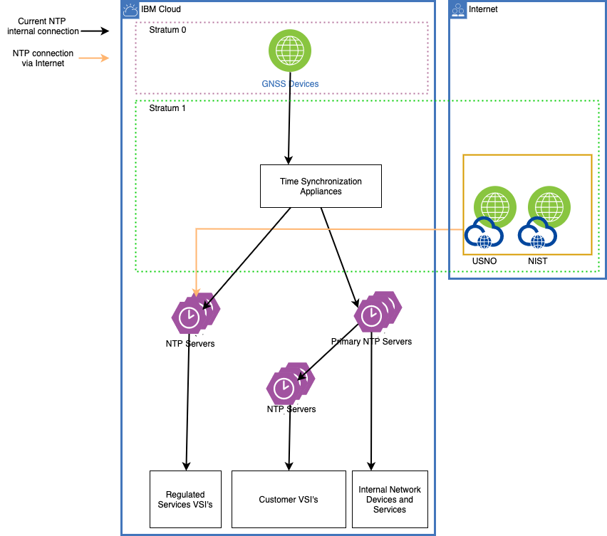

---
copyright:
  years: 2021
lastupdated: "2021-11-23"

keywords: NTP, NTP server, network time protocol

subcollection: cloud-infrastructure

---

{:new_window: target="_blank"}
{:shortdesc: .shortdesc}
{:screen: .screen}
{:codeblock: .codeblock}
{:pre: .pre}
{:tip: .tip}
{:note: .note}
{:external: target="_blank" .external}

# IBM Cloud NTP service overview
{: #ntp-service-overview}

{{site.data.keyword.cloud}} hosts are synchronized to internal IBM Network Time Protocol (NTP) servers that take their time from Stratum 1 devices, with GNSS appliances that are owned by IBM connected to them.
{: shortdesc}

## Configuring NTP servers
{: #ntp-config-guidelines}

The NTP server that you use to synchronize time for an application depends on where the application is running:

- If the application is running in {{site.data.keyword.cloud_notm}} Classic Infrastructure, set your NTP server to `time.service.networklayer.com`.
- If the application is running in {{site.data.keyword.cloud_notm}} VPC, set your NTP server to `time.adn.networklayer.com`.
- If the application is not using {{site.data.keyword.cloud_notm}} NTP services, check [Network Time Protocol Servers](https://support.ntp.org/bin/view/Servers){: external} to find suitable NTP servers for your application.

## NTP Stratum ranking
{: #ntp-stratum-ranking}

IBM has implemented Global Navigation Satellite System (GNSS) devices within the {{site.data.keyword.cloud_notm}} data centers, providing an effective Stratum 0 source for internal servers that are directly connected to it (Stratum 1).

Aside from GNSS antennas, the appliances are connected to a high performance oscillator, such as a rubidium atomic clock, that keeps the appliance clock accurate for long periods in the event of a GNSS service disruption.

The National Institute of Standards and Technology (NIST) and US Naval Observatory (USNO) Stratum 1 sources are also configured on the time servers that are available for Regulated Services Cloud NTP servers (for NTP servers located in the United States only).

The NTP time servers are connected to these GNSS and time synchronization appliance services, as depicted in Figure 1.

{: caption="Figure 1. NTP Service overview" caption-side="bottom"}

## Software components
{: #ntp-software-components}

NTP services provide a complete implementation of the Network Time Protocol (NTP) version 4, but retains compatibility with versions 1, 2, and 3 as defined by RFC 1059, RFC 1119, and RFC 1305, respectively.

## Security
{: #ntp-security}

Only NTP time packets are allowed to transfer between the customer-accessible NTP servers (customer mirrors) and end users ({{site.data.keyword.cloud_notm}} VPC and {{site.data.keyword.cloud_notm}} Classic Infrastructure servers). It is important to note that the majority of attacks against an NTP server can be mitigated with proper configuration of the NTP server itself to limit functionality to only the required responses.  NTP servers are restricted from public access, and only allowed networks are able to connect to the master time source in each environment. At each level, the information that NTP clients are allowed to receive from the NTP server is restricted.

## High availability 
{: #ntp-high-availability} 

The NTP service for customer workloads is backed by a highly available architecture. There are multiple GNSS devices deployed across {{site.data.keyword.cloud_notm}} that rely on multiple satellites available on the GPS network. Each appliance, aside from the GPS source, has a local atomic clock device connected to it. Every NTP server providing services to customer workloads is configured to use any of the available Stratum 1 sources in case the closest one fails.
