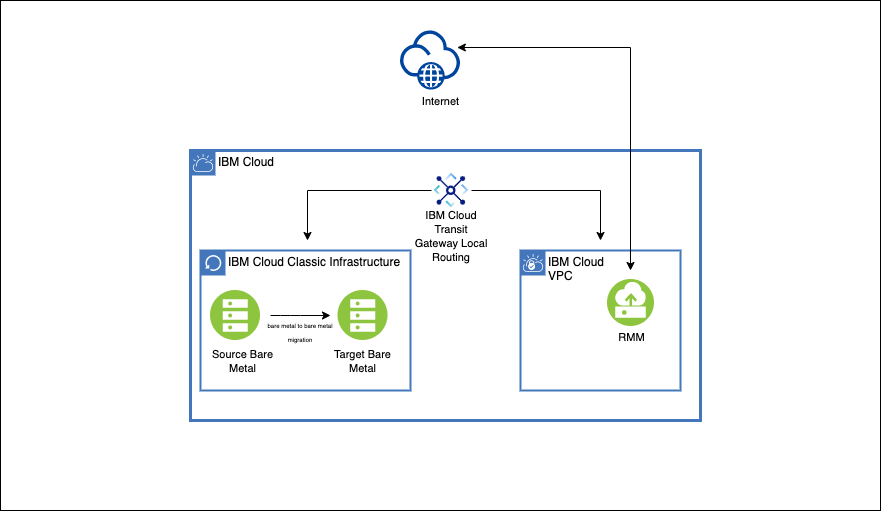

---

copyright:
  years:  2021, 2022
lastupdated: "2022-11-23"

keywords: migration, migrate, migrating, migrate infrastructure

content-type: tutorial
services: virtual-servers
account-plan: paid
completion-time: 45m
subcollection: cloud-infrastructure

---

{:external: target="_blank" .external}
{:shortdesc: .shortdesc}
{:screen: .screen}
{:pre: .pre}
{:table: .aria-labeledby="caption"}
{:codeblock: .codeblock}
{:tip: .tip}
{:download: .download}
{:important: .important}
{:note: .note}
{:step: data-tutorial-type='step'}

# IBM Cloud classic bare metal to classic bare metal migration
{: #p-p-migration-bare-metal-overview}
{: toc-content-type="tutorial"} 
{: toc-services="virtual-servers"} 
{: toc-completion-time="45m"}

RackWare Management Module (RMM) solution simplifies the overall migration process of moving the operating system, applications, and data from one bare metal server to another in the {{site.data.keyword.cloud}} classic environment. The migration can occur either over the public or private interface of the compute resource. The only requirement is that RMM must be able to access both source and target server over SSH.
{: shortdesc}

## Objectives
{: #p-p-migration-bare-metal-objective}

- Prepare the source and target servers
- Learn what is needed for the supported network topology
- Learn how to use the RMM solution

## Limitations
{: #p-p-migration-bare-metal-limitations}

1. Encrypted volumes are not supported.
2. Do not modify the target. If anything is modified out of control of RMM after the first migration, it can be wiped out and the result can be unexpected.
3. The RMM solution handles only the OS, application, and data movement, so anything else needs to be set up by you (for example, security groups, subnets, etc.).
4. For data migration, file performance and endurance storage are not supported. You can use third-party tools such as `rsync` for data migration on block and file.

## Supported operating systems
{: #p-p-migration-bare-metal-supported-os}

- CentOS 7.8, 7.9

- RHEL 7.2, 7.3, 7.4, 8.1

- Ubuntu 18.04, 20.04

- Debian 9.x, 10.x

- Windows 2012, 2012R2, 2016, 2019

## Supported topology
{: #p-p-migration-bare-metal-supported-topology}

Migration can be done either over the public or the private interface. While RMM uses SSH to communicate with the servers, migrate by using the private address. In addition, you get to use {{site.data.keyword.IBM_notm}}'s network during migration over the private interface.

Because RMM is deployed in {{site.data.keyword.vpc_short}}, it requires a transit gateway for the RMM to communicate with the source and the target server over the private interface. The source and target server also need to be able to communicate with one another.

If the source and target server do not have direct communication, then consider using pass-through with the RMM server. The RMM server acts as a proxy, and migration flows through the RMM server. For more information, search for pass-through in the [RMM user guide](https://www.rackwareinc.com/rackware-rmm-users-guide-for-ibm-cloud){: external}. The pass-through migration time increases.
{: note}

To create an {{site.data.keyword.tg_full_notm}} and establish connection between classic and VPC, review the following information:

- [Planning for {{site.data.keyword.tg_full_notm}}](/docs/transit-gateway?topic=transit-gateway-helpful-tips)

- [Ordering {{site.data.keyword.tg_full_notm}}](/docs/transit-gateway?topic=transit-gateway-ordering-transit-gateway)

For transit gateway and classic, you need to follow two steps:

1. Enable VLAN spanning to allow communication between subnets and data centers in classic. For more information, see [VLAN spanning](/docs/vlans?topic=vlans-vlan-spanning).

2. To allow communication between VPC and classic, both transit gateway and enabling VRF in classic are necessary. For more information, see [Planning for {{site.data.keyword.tg_full_notm}}](/docs/transit-gateway?topic=transit-gateway-helpful-tips#general-considerations).

{: caption="Figure 1. Network topology of RMM and bare metal migration" caption-side="bottom"}

This architecture diagram is applicable for bare metal to virtual server and virtual server to virtual server scenarios.
{: note}

## Before you begin
{: #p-p-migration-bare-metal-supported-topology}

1. For each volume on the source server, 20 percent of the unused space must be available to store the snapshot that is created by RMM. 

2. Copy the RMM SSH public key to both the source and target.

    a. This process can require modifying the servers' host route table or security rules.

    b. Update the name server or DNS.

3. The order of target server, the CPU, and memory does not need to match, but the volumes must be equal or greater than the source.

4. Make sure to have `/etc/fstab` entry for automatic mounting of any file system on the target server.

## Order RMM
{: #p-p-migration-bare-metal-order-rackware}
{: step}

The RMM tool is available in the {{site.data.keyword.cloud_notm}} catalog. After you order, a virtual server with RMM software is installed into your VPC of choice. The RMM server has a public IP address for reachability and a default login.

If public IP address is not attached to RMM server then, its 'Reserved IP' address can be used to access RMM server with [bastion host](https://cloud.ibm.com/docs/solution-tutorials?topic=solution-tutorials-vpc-secure-management-bastion-server).
{: note}

1. Order the RMM server from the [{{site.data.keyword.cloud_notm}} catalog](https://cloud.ibm.com/catalog/content/IBM-MarketPlace-P2P-1.3-22935832-bd76-49ab-b53e-12fc5d04c266-global){: external}.

2. After you order, log in to the RMM server.

3. In the RMM server, change the default password, create users, and create an SSH key.

4. Upload the SSH key to {{site.data.keyword.vpc_short}}.

## Order a license
{: #p-p-migration-bare-metal-ordering-license}
{: step}

The license required for migration to {{site.data.keyword.cloud_notm}} is Bring Your Own License (BYOL). You need to purchase the license directly from RackWare.

Follow these steps to get a license:

1. Order your license from [RackWare](mailto:sales@rackwareinc).

2. Run the following command on the RMM CLI to generate a preinstall file:

    ```
    rwadm relicense
    ```
    {: pre}

3. After generating a preinstall file, send a license generation request to the [RackWare licensing team](mailto:sales@rackwareinc) with the following information:

    a. RMM license (subject line)

    b. Company name
    
    c. License count

    d. Preinstall file (attached)

    e. Purchase order (attached)

4. Install the license.

    a. After the valid license is received, download the license file and place it in `/etc/rackware`. Restart the services to apply the license by running the following command:
    
    ```
    rwadm restart
    ```
    {: pre}

    b. Verify the license by running the following command:

    ```
    rw rmm show
    ```
    {: pre}

## Prepare source and target servers
{: #p-p-migration-bare-metal-source-target}
{: step}

There are a few things that you need to do on the source and target device for the migration:

1. The RMM server needs to connect with servers that use SSH; thus the RMM public SSH keys need to be copied on both the source and target servers. 

2. If the source device has both public and private interfaces, host routes need to be added to ensure the communication between the source and target servers. This is done over the transit gateway path. Complete the following steps to prepare your relevant servers:

### Linux systems
{: #linux-systems}

Copy RMM SSH public key to both the source and target servers.

### Windows systems
{: #windows-systems}

1. Copy the RMM SSH public key to both the source and target servers.
2. You need to download the SSH key utility. You can download it from the RMM server: `https://<RMM IP>/windows/RWSSHDService_x64.msi`
3. You are `SYSTEM`, and you need to key in the RMM SSH key to authenticate for both the source and target servers.

## Set up RMM waves
{: #p-p-migration-bare-metal-setup-waves}
{: step}

You can migrate servers over one-by-one or perform simultaneous migrations. If you are performing multiple, simultaneous migrations, download the CSV template from the RMM server and complete the appropriate fields.

1. Log in to the RMM server.
2. Create a _Wave_ and define _Wave_ name.
3. If there are multiple hosts, download the template, complete the appropriate fields, and then upload the template.
4. Select the _Wave_ name to enter source and target information.
5. Select the "+" sign.
6. Add source IP address or FQDN and add source username. 
7. Target Type = Existing system
8. Sync Type = Direct sync
9. Add target IP address or FQDN.
10. Add a target-friendly name, and add a target username.
11. Start the migration.

The username field for Linux environments is `root`. The username field for Windows environments is `SYSTEM`.
{: note}

## Migrate
{: #p-p-migration-bare-metal-perform-migration}
{: step}

1. After the source and target host are added in wave and replication record, click the **Sync Options** tab on right top of pop up screen,  select the **No Transfer** option and click **Modify**. Then click the play/arrow head icon to start replication. This will perform a dry run by checking the connection between the RMM and source/target servers. This will not migrate data. If the operation is successful then remove the **No Transfer** option that uses the same process.

2. Whenever you are ready, go ahead and click **start replication** (the play/arrow head icon on the left top). This will start the actual migration. If you expand the replication record, it displays actual steps being executed in summary with necessary information.

3. Whether the operation is successful or whether it failed, you can see the job history in the replication record.

4. In case of failure, you can retrieve the log and review detailed information.

To improve data transfer rate, adjust bandwidth allocation of RMM server. To know how to change bandwidth allocation, see [Adjusting bandwidth allocation using the UI](/docs/vpc?topic=vpc-managing-virtual-server-instances&interface=ui#adjusting-bandwidth-allocation-ui).
{: note}

## Validate your migration
{: #p-p-migration-bare-metal-post-migration}
{: step}

After your migration, validate or update the following:

1. Access the target server.
2. Check partitions and volumes.
3. Check applications.
4. Install any test application in the target server.
5. Check networking routes.
6. Check or update application or operating system licenses.
7. Remove RMM SSH key.

## Help and support
{: #p-p-migration-bare-metal-help}

* [RackWare Cloud Migration](https://www.rackwareinc.com/cloud-migration){: external}
* [RackWare RMM user guide for {{site.data.keyword.cloud_notm}}](https://www.rackwareinc.com/rackware-rmm-users-guide-for-ibm-cloud){: external}
* [FAQS for classic bare metal to classic bare metal](/docs/cloud-infrastructure?topic=cloud-infrastructure-bare-metal-faqs)