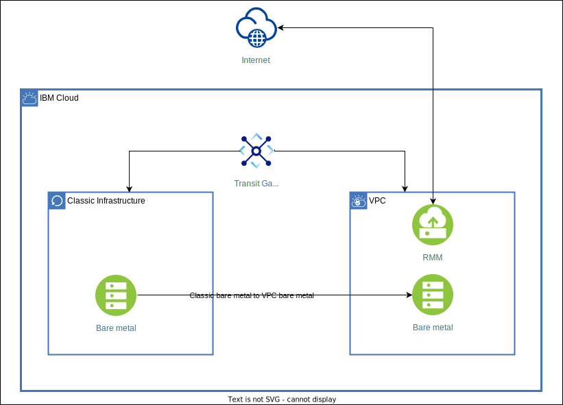
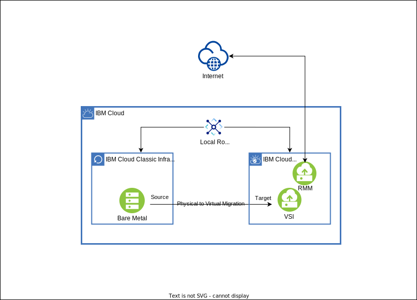

---

copyright:
   years: 2021, 2022
lastupdated: "2022-12-16"

keywords: migration, physical to virtual, migrate
content-type: tutorial
services: virtual-servers, vpc, transit-gateway
account-plan: paid
completion-time: 25m
subcollection: cloud-infrastructure

---

{:shortdesc: .shortdesc}
{:screen: .screen}  
{:codeblock: .codeblock}  
{:pre: .pre}
{:tip: .tip}
{:note: .note}
{:external: target="_blank" .external}
{:step: data-tutorial-type='step'}

# Classic bare metal to bare metal or virtual server on VPC using a private network
{: #pv-migration-private-network} 
{: toc-content-type="tutorial"} 
{: toc-services="virtual-servers, vpc, transit-gateway"} 
{: toc-completion-time="25m"}

This is the process of migrating from a classic physical bare metal server to a bare metal or virtual server instance on VPC environment. The RackWare Management Module (RMM) solution simplifies the overall migration process of moving the operating system, applications, and data from the classic bare metal to bare metal or virtual server instance on an IBM Cloud® VPC.
{: shortdesc}

The migration can occur either over the public or private interface of the compute resource. The only requirement is all three components are reachable from one and another. This guide focuses on the private path, as this is a bit more involved, which requires setting up a transit gateway for a communication channel between classic and VPC over the private interface.

## Objectives
{: #pv-migration-private-network-objectives}

* Prepare your source and target machines for migration.
* Learn how to use the RMM solution.
* Successfully complete a classic bare metal to VPC bare metal migration for private networks.

## Architecture diagram
{: #pv-migration-private-network-architecture}

{: caption="Figure 1. Migrating classic bare metal to bare metal on VPC over private interface" caption-side="bottom"}

{: caption="Figure 2. Migrating classic bare metal to virtual server instance on VPC over private interface" caption-side="bottom"}

This architecture diagram is also applicable for classic bare metal to VPC bare metal.
{: note}

## Before you begin
{: #pv-migration-private-network-prereqs}

* Check for correct {{site.data.keyword.vpc_short}} user permissions. Be sure that your user account has sufficient permissions to create and manage VPC resources. See the list of [required permissions](/docs/vpc?topic=vpc-managing-user-permissions-for-vpc-resources) for VPC.
* Understand the differences between classic and VPC infrastructures (the following list is not exhaustive):
    * VPC does not support shared volumes or file-based volumes
    * VPC does not support snapshot or replication
    * GPU is not supported in VPC
* For more information, see [Comparing {{site.data.keyword.cloud_notm}} classic and VPC infrastructure environments](/docs/cloud-infrastructure?topic=cloud-infrastructure-compare-infrastructure).
* Plan for your target server. For more information, see [Planning for Bare Metal Servers on VPC](/docs/vpc?topic=vpc-planning-for-bare-metal-servers&interface=ui).

## Supported Operating Systems
{: #classic-bare-metal-supported-os}

* For classic bare metal to VPC bare metal

    - Ubuntu 20.04

* For bare metal to VPC virtual server instance

    - CentOS 7.8, 7.9

    - RHEL 7.2, 7.3, 7.4, 8.1

    - Ubuntu 18.04, 20.04

    - Debian 9.x, 10.x

    - Windows 2012, 2012R2, 2016, 2019

The **Convert LVM** feature is only supported for RHEL 7.x and RHEL 8.x
{: note}

## Order RMM
{: #order-rackware-rmm}
{: step}

The RMM tool is available in the {{site.data.keyword.cloud_notm}} catalog. After you order, a virtual server with RMM software is installed into your VPC of choice. The RMM server has a public IP address for reachability and a default login.

If public IP address is not attached to RMM server, then its 'Reserved IP' address can be used to access RMM server with [bastion host](https://cloud.ibm.com/docs/solution-tutorials?topic=solution-tutorials-vpc-secure-management-bastion-server).
{: note}

1. Order the RMM server from the [{{site.data.keyword.cloud_notm}} catalog tile](https://cloud.ibm.com/catalog/content/Rackware-Golden-Template-1.11-06545490-596b-4133-8516-8425a11b3265-global){: external}.
2. After you order, log in to the RMM server.
3. In the RMM server, change the default password, create users, and create an SSH key with the correct name.

## Set up and provision VPC, bare metal server, or virtual server instance
{: #set-up-provision-vpc-vsi}
{: step}

Target bare metal server can only be provided manually. There are two different methods for setting up the target virtual server: manual or the RMM auto-provision feature.

### Option 1: Manual
{: #option1-manual}

The RMM solution handles only the OS, application, and data movement. It does not to set up a VPC on the target side; therefore, you need to set up the VPC infrastructure. At a bare minimum, you need to set up a VPC, subnets, and bare metal or virtual server instances. For more information, see the [Virtual Private Cloud (VPC) documentation](/docs/vpc?topic=vpc-getting-started).

1. Create a VPC. 
2. Create subnets. 
3. Order bare metal or virtual server instance. 
    * SSH key 
    * Operating system name (Linux or Windows and their respective version) 
    * Security groups 
    * Secondary volume (optional) 

Encrypted volumes are not supported.
{: note}

### Option 2: Auto-provision
{: #option2-auto-provision}

#### Setting up a cloud user
{: #setting-up-cloud-user}

1. Log in to the RackWare web console.
2. In the RackWare web console, navigate to **Configuration > Clouduser**.
3. When you add a cloud user, enter a name and select _{{site.data.keyword.vpc_short}}_ for the **Cloud Provider**. Select the region where you want to auto-provision the virtual server instance, and enter your {{site.data.keyword.cloud_notm}} API key.
4. Click **Add**.

#### Creating a wave and replication
{: #creating-wave}

A wave contains a single host or multiple hosts that are migrated. For this migration, you need to create one or more waves, provide information about the hosts in the wave, and then start the wave.

1. In the RackWare web console, navigate to **Replication > Waves**.
2. When you create a wave, select **Target Type** as **Autoprovision**.
3. Enter source and target details.

If the source machine has a Linux&reg; operating system and it has a boot volume greater than 100 GB, then leave ‘Provision disk’ textbox empty and select **Convert to LVM** option. This creates additional disk of required size and will convert all eligible volumes to LVM on the target. In case of Windows, no action is required. It is taken care automatically by RMM.
{: note}

4. After you enter your source and target information, you need to provide your {{site.data.keyword.vpc_short}} information.
5. From the edit option in **Actions** menu of your source, select the **{{site.data.keyword.vpc_short}} Options** tab, enter the relevant information, and click **Modify**.
6. Run the replication.
    
Ensure that your VPC, subnet, and other necessary cloud components are set up before you add a cloud user in RMM.
{: note}

#### Assigning environment to wave
{: #assigning-wave}

1. In the RackWare web console, navigate to **Replication > Waves**.
2. Select the wave that needs to be migrated.
3. On the **Wave Detail** page, select the Autoprovision option as **Not configured**.
4. Select your cloud user for the **Environment**, enter the region where the virtual server instance needs to be provisioned, and apply the changes.

Auto-provision feature is not available if target is VPC bare metal. User needs to select **Existing System** as target type in this case.
{: note}

## Prepare source and target servers
{: #prepare-source-target-machines}
{: step}

There are a few things that need to be done on the source and target server for the migration to work. The RMM server needs to SSH into the machines; thus, the RMM public SSH keys need to be copied onto both the source and target servers. In addition, if the source server has both public and private interfaces, host routes need to be added to ensure the communication between the source and target servers occurs over the transit gateway path. Complete the following steps to prepare your relevant servers.

### Linux systems
{: #linux-systems}

1. Copy the RMM SSH public key to both the source and target servers.
2. If your compute resource has both public and private IP addresses, the host level route needs to be added for it to work properly. Run the following command on your classic compute resources for your operating system:

```
ip route add <destination_network> via <Gateway_address> dev <private_ethernet_interface>
```
{: pre}

### Windows systems
{: #windows-systems}

1. Copy the RMM SSH public key to both the source and target servers.
2. You need to download the SSH key utility. You can download it from the RMM server.
3. The user is `SYSTEM`, and you need to key in the RMM SSH key to authenticate for both the source and target servers.
4. If your compute resource has both public and private IP addresses, the host level route needs to be added for it to work properly. Run the following command on your classic compute resources for your operating system:

```
route ADD <destination_network> MASK <subnet_mask> <gateway_ip> <metric_cost>
```
{: pre}

If you use the auto-provision feature, there is no need to set up a target. Only the friendly name for the target server is required.
{: note}

## Set up RMM waves
{: #set-up-rackware-rmm-p2v-migration}
{: step}

You can migrate the machines over one by one or do simultaneous migrations. If you are doing multiple, simultaneous migrations, download the CSV template from the RMM server and complete the appropriate fields.

1. Log in to the RMM server.
2. Create a _Wave_ and define _Wave_ name.
3. If there are multiple hosts, download the template, complete the appropriate fields, and then upload the template.
4. Select the _Wave_ name to enter source and target information.
5. Select the "+" sign.
6. Add source IP address or FQDN and add source username. 
7. Target Type = Existing system
8. Sync Type = Direct sync
9. Add target IP address or FQDN.
10. Add a target-friendly name, and add a target username.
11. Start the migration.

The username field for Linux environments is `root`. The username field for Windows environments is `SYSTEM`. 
{: note}

Within the discovery script, a helper script is provided to help with the discovery of the classic bare metals and creating the waves for steps 2 and 3. The script asks for your classic username and API to discover your classic bare metals.

```
/opt/IBM/discoverTool -d
```
{: pre}

For more information on the discovery tool, click [here](https://github.com/IBM-Cloud/vpc-migration-tools/tree/main/v2v-discovery-tool-rmm){: external}.

## Order IBM Cloud Transit Gateway
{: #order-transit-gateway}
{: step}

{{site.data.keyword.tg_full_notm}} provides connectivity between classic and your VPC infrastructure. When you connect the two entities, be aware that the classic infrastructure is on the `10.0.0.0` network, which means that the VPC network needs to be a on different network; otherwise, the networks overlap and cause communication issues. 

1. Order {{site.data.keyword.tg_full_notm}}
    * Use local routing option 
2. Add connections 
    * Classic infrastructure 
    * VPC 
     * Select region 
     * Select VPC 

## Validate your migration
{: #validate-pv-migration}
{: step}

Before you decommission the source server, you need to validate the target server. Make sure to validate the following:
* Application
* Licensing
* Reachability (host-level configuration changes)
* Remove RMM SSH key
