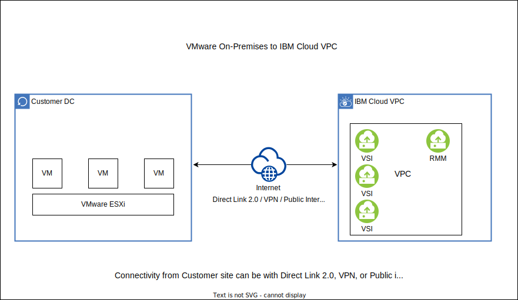

---

copyright:
  years:  2021, 2022
lastupdated: "2022-04-27"

keywords:
content-type: tutorial
services: vpc, virtual-servers
account-plan: paid
completion-time: 45m
subcollection: cloud-infrastructure

---

{:external: target="_blank" .external}
{:shortdesc: .shortdesc}
{:screen: .screen}
{:pre: .pre}
{:table: .aria-labeledby="caption"}
{:codeblock: .codeblock}
{:tip: .tip}
{:download: .download}
{:important: .important}
{:note: .note}
{:step: data-tutorial-type='step'}

# On-premises VMware VM to IBM Cloud VPC migration with RMM
{: #migrating-images-vmware-vpc}
{: toc-content-type="tutorial"} 
{: toc-services="vpc, virtual-servers"} 
{: toc-completion-time="45m"}

To implement a data center transformation, the RackWare Management Module (RMM) migration solution provides a seamless virtual-to-virtual replatforming for VMware virtual machine (VM) to {{site.data.keyword.cloud}} virtual server instance migration. It allows the adoption of existing capabilities of {{site.data.keyword.cloud_notm}}. Its intuitive GUI allows you to move the OS, application, and data from VMware ESXi to {{site.data.keyword.vpc_short}} virtual server instance.
{: shortdesc}
 
This guide shows you how to complete a migration from your on-premises VMware VM to {{site.data.keyword.vpc_short}}.

## Supported operating systems
{: #supported-operating-systems-vmware}

- CentOS 7.8, 7.9
- RHEL 7.2, 7.3, 7.4, 8.1 
- Ubuntu 18.04, 20.04
- Debian 9.x, 10.x 
- Windows 2012, 2012R2, 2016, 2019 

## Architecture diagram
{: #architecture-diagram-vmware}

{: caption="Figure 1. Architecture diagram" caption-side="bottom"}

## Before you begin
{: #before-begin-vmware}

* Check for correct {{site.data.keyword.vpc_short}} user permissions. Be sure that your user account has sufficient permissions to create and manage VPC resources. See the list of [required permissions](/docs/vpc?topic=vpc-managing-user-permissions-for-vpc-resources) for VPC.
* Understand the capability differences between VMware and VPC infrastructures (the following list is not exhaustive):
    * VPC does not support shared volumes or file-based volumes
    * GPU is not supported in VPC
    * Encrypted volumes are not supported

To improve data transfer rate, adjust the bandwidth allocation of the RMM server. For more information, see [Adjusting bandwidth allocation using the UI](/docs/vpc?topic=vpc-managing-virtual-server-instances&interface=ui#adjusting-bandwidth-allocation-ui).
{: note}

## Order RMM
{: #order-rackware-rmm-vmware}
{: step}

The RMM tool is available in the {{site.data.keyword.cloud_notm}} catalog. After you order, a virtual server with RMM software is installed into your VPC of choice. The RMM server has a public IP address for reachability and a default login.

If public IP address is not attached to RMM server then, its 'Reserved IP' address can be used to access RMM server with [bastion host](https://cloud.ibm.com/docs/solution-tutorials?topic=solution-tutorials-vpc-secure-management-bastion-server).
{: note}

1. Order the RMM server from the [{{site.data.keyword.cloud_notm}} catalog](https://cloud.ibm.com/catalog/content/IBM-MarketPlace-P2P-1.3-22935832-bd76-49ab-b53e-12fc5d04c266-global){: external}.

2. After you order, log in to the RMM server.

3. In the RMM server, change the default password, create users, and create an SSH key.

4. Upload the SSH key to {{site.data.keyword.vpc_short}}.
 
## Bring Your Own License (BYOL) from RackWare
{: #license-rackware-bring-vmware}
{: step}

1. Generate a license file in `/etc/rackware` by running the following command:

   ```
   rwadm relicense 
   ```
   {: pre}

2. You need to purchase the license from RackWare by emailing the generated license file to [licensing@rackwareinc.com](mailto:licensing@rackwareinc.com) or [sales@rackwareinc.com](mailto:sales@rackwareinc.com). 

3. After you receive a valid license, download the license file and place it in `/etc/rackware`. Restart the services to apply the license by running the following command:

   ```
   rwadm restart
   ```
   {: pre}
 
4. Verify the license by running the following command:

   ```
   rw rmm show 
   ```
   {: pre}

## Connectivity options between the customer data center and IBM Cloud VPC 
{: #connectivity-customer-vpc}
{: step}

Your source and target server should communicate with each other and the RMM. This can be done over the public internet with public IPs or with a private-only environment. If you have a private-only environment, you must set up either a VPN or Direct Link 2.0:

- Use the [Direct Link 2.0](/docs/dl?topic=dl-get-started-with-ibm-cloud-dl) connection to {{site.data.keyword.cloud_notm}}. It is a costly solution and can be considered only if Direct Link 2.0 is already present. 

- [Site-to-site VPN](/docs/vpc?topic=vpc-vpn-overview)

## Set up and provision VPC and virtual server instances
{: #cloud-vpc-vsi-setup}
{: step}

There are two different methods for setting up the target virtual server: manual or the RMM auto-provision feature.

### Option 1: Manual
{: #option1-manual}

The RMM solution handles the OS, application, and data movement. It does not need to set up a VPC target side; you need to handle the setup. You first set up the VPC infrastructure. At a bare minimum, you must set up a VPC, subnets, and the corresponding virtual server instances that you are planning to migrate. The new target virtual server instance profile (vCPU and vMemory) does not need to match the source. However, as for the storage, it needs to be the same or greater in size.

This document does not provide the details for setting up the VPC infrastructure. It is described in each of the relevant VPC product document pages.
{: note}

1. Create a VPC. 
2. Create subnets. 
3. Order the virtual server instance. 
    * SSH key (RMM SSH keys need to be added in addition to bastion SSH key)
    * Operating system name (Linux or Windows and their respective version) 
    * Security groups 
    * Secondary volume 

### Option 2: Auto-provision
{: #option2-auto-provision}

#### Setting up a cloud user
{: #setting-up-cloud-user}

1. Log in to the RackWare web console.
2. In the RackWare web console, navigate to **Configuration > Clouduser**.
3. When you add a cloud user, enter a name and select _{{site.data.keyword.vpc_short}}_ for the **Cloud Provider**. Select the region where you want to auto-provision the virtual server instance, and enter your {{site.data.keyword.cloud_notm}} API key.
4. Click **Add**.

#### Creating a wave and replication
{: #creating-wave}

A wave contains a single host or multiple hosts that will be migrated. For this migration, you need to create one or more waves, provide information about the hosts in the wave, and then start the wave.

1. In the RackWare web console, nagivate to **Replication > Waves**.
2. When you create a wave, select **Target Type** as **Autoprovision**.
3. Enter source and target details. If the source has a boot volume greater than 250 GB, select **Right Sizing** from **Advanced Options** since {{site.data.keyword.vpc_short}} does not support a boot volume greater than 250 GB.
4. After you enter your source and target information, you need to provide your {{site.data.keyword.vpc_short}} information.
5. From the edit option in **Actions** menu of your source, select the **{{site.data.keyword.vpc_short}} Options** tab, enter the relevent information, and click **Modify**.
6. Run the replication.
    
Ensure that your VPC, subnet, and other necessary cloud components are set up before you add a cloud user in RMM.
{: note}

#### Assigning environment to wave
{: #assigning-wave}

1. In the RackWare web console, nagivate to **Replication > Waves**.
2. Select the wave that needs to be migrated.
3. On the **Wave Detail** page, select the Autoprovision option as **Not configured**.
4. Select your cloud user for the **Environment**, enter the region where the virtual server instance needs to be provisioned, and apply the changes.

## Source and target compute preparation
{: #source-target-compute-prep-vmware}
{: step}

Before starting the migration, RMM server needs to SSH into the virtual machines. Thus, the RMM public SSH keys need to be copied on both the source and target servers.
 
For Windows OS, you need to download the SSH key utility. You can download it from RMM server.
{: note}
 
For Windows OS, the user is `SYSTEM` and you must key in the RMM SSH key here to authenticate for both source and target servers.
{: note}

If you use the auto-provision feature, there is no need to set up a target. Only the friendly name for the target server is required.
{: note}

## Set up RMM waves
{: #rackware-rmm-v2v-migration}
{: step}

You can migrate servers one-by-one or run multiple, simultaneous migrations. If you are running multiple, simultaneous migrations, then download the CSV template from the RMM server and populate the appropriate fields.

1. Log in to the RMM server.
2. Create a _Wave_ and define _Wave_ name.
3. If there are multiple hosts, download the template, complete the appropriate fields, and then upload the template.
4. Select the _Wave_ name to enter source and target information.
5. Select the "+" sign.
6. Add source IP address or FQDN and add source username. 
7. Target Type = Existing system
8. Sync Type = Direct sync
9. Add target IP address or FQDN.
10. Add a target-friendly name, and add a target username.
11. Start the migration.
 
The username field for the Linux environment is `root`. The username field for the Windows environment is `SYSTEM`.
{: note}
 
Alternatively, you can use the discovery helper script, which helps with the discovery of virtual machines on the VMware ESXi Host and also creates corresponding waves on the RMM server. The script asks for your vSphere host username, for the IP address of the vSphere to connect to, and the API where you discover your on-premises or classic VMware ESXi Host VMs.
 
```
./discoveryTool -s <vSphere> -u <username of the Vspherehost>
```
{: pre}

Example:

```
$ ./discoveryTool -s 10.10.10.9 -u administrator@vsphere.local
```
{: screen}
 
For more information about discovering the VMware guest VMs that use the Discovery Tool, see this [public GitHub repository](https://github.com/IBM-Cloud/vpc-migration-tools/blob/main/v2v-discovery-tool-rmm/VMware/README.md){: external}

## Validate your migration
{: #rackware-rmm-v2v-validation}
{: step}

Before decommissioning the source server, it is imperative to validate the target server. The following list is not exhaustive, but suggests some of the items to validate:

- Application 
- Licensing 
- Reachability (host-level configuration changes) 
- Remove RMM SSH key after migration successful 
 
## More resources
{: #rackware-rmm-v2v-resources}

1. [Discovery Tool](https://github.com/IBM-Cloud/vpc-migration-tools/blob/main/v2v-discovery-tool-rmm/VMware/README.md){: external}
2. [FAQs](/docs/cloud-infrastructure?topic=cloud-infrastructure-faqs-vmware)
3. [RackWare usage guide](https://www.rackwareinc.com/cloud-migration){: external}
