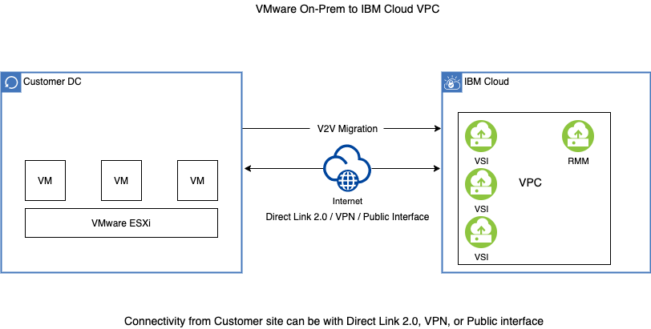

---

copyright:
  years:  2021
lastupdated: "2021-10-03"

keywords: image migration, migrate image, vmdk, vhd

subcollection: cloud-infrastructure

---

{:external: target="_blank" .external}
{:shortdesc: .shortdesc}
{:screen: .screen}
{:pre: .pre}
{:table: .aria-labeledby="caption"}
{:codeblock: .codeblock}
{:tip: .tip}
{:download: .download}
{:important: .important}
{:note: .note}

# VMWare VM On-Prem to IBM Cloud VPC VSI migration with Rackware RMM 
{: #migrating-images-vmware-vpc} 

When embarking on a data center transformation, Rackware RMM migration solution provides a seamless virtual-to-virtual re-platforming for VMWare virtual machine (VM) to IBM Cloud virtual server instance (VSI) migration that allows you to adopt the native capabilities of IBM Cloud.  Its intuitive GUI allows you to move the OS, Application, and data from VMware ESXI to IBM VPC VSI.  
 
In this guide, we will show you how to complete a V2V migration from Vmware in On-Prem to IBM Cloud VPC. It supports migrating Windows Server 2012, 2012R2, 2016, and 2019, Red Hat Enterprise Linux (RHEL), CentOS, Ubuntu, and Debian Linux operating systems. 

{: caption="Architecture Diagram"}
 
## Services used
{: #services-used-vmware}

- IBM Cloud VPC VSI 
- Rackware RMM 

## Before you begin
{: #before-begin-vmware}

- Check for correct permissions for IBM Cloud VPC. 
- While this is not an exhaustive list, understand the capability differences between VMWare and VPC such as: 
    - VPC does not support shared volumes or file-based volumes 
    - No GPU supports are allowed
    - Encrypted volumes are not supported

## General steps

1.  Order Rackware RMM (IBM Catalog Tile) 

2. BYOL (Bring Your Own License) from Rackware 

3. Setup and provision IBM Cloud VPC and VSI

4. Connectivity between customer’s Data Center and IBM Cloud VPC 

5. Source and target preparation 

6. V2V migration setup 

7. Validation 

## Order Rackware RMM
{: #order-rackware-rmm-vmware}
{: step}

Rackware RMM tool is available on the IBM Catalog Marketplace. 

A VSI with the Rackware RMM software will be installed into the VPC which was provided while ordering on the Catalog page.
The RMM server will have a public IP address for reachability and for default login post provisioning the VSI.

1. Order Rackware RMM server from the IBM Cloud Marketplace.

    a. Select your Resource Group.

    b. Enter the VPC in which this should be created.

    c. Enter the resource_group. 

    d. Provide the SSH key.

    e. Provide the API key.

    f. Provide the Region and Zone.

2. Login into the Rackware RMM Server.

    a. Change the default password.

    b. Create Users.

    c. Create an SSH Key.

    d. Upload the SSH key to the IBM Cloud VPC.
 
 ##  BYOL (Bring Your Own License) from RackWare
{: #license-rackware-bring-vmware}
{: step}

1. Generate a license file under the `/etc/rackware` by running this command:                    

        $ rwadm relicense 
 
    You will need to purchase the license from Rackware by mailing the generated license file to licensing@rackwareinc.com or sales@rackwareinc.com. 

2. Once the valid license is received, download the license file and place it under `/etc/rackware`. Then restart the services to apply the license using this command:
 
        $ rwadm restart 
 
3. Verify the validity of the license:

        $ rw rmm show 

## Connectivity options between the customer data center and the IBM cloud VPC 
{: #connectivity-customer-vpc}
{: step}

- Use the [Direct Link](https://cloud.ibm.com/docs/dl?topic=dl-get-started-with-ibm-cloud-dl) 2.0 connection to IBM Cloud. This is a costly solution and should only be considered if Direct Link 2.0 is already present. 

-  [Site-to-site VPN](https://cloud.ibm.com/docs/vpc?topic=vpc-vpn-overview)

- Public interface 

##  IBM Cloud VPC VSI setup
{: #cloud-vpc-vsi-setup}
{: step}

The RackWare RMM solution only handles the OS, application, and data movement. It does not to set up a VPC target side; you need to handle this. You will first need to set up the VPC infrastructure. At a bare minimum, you will need to set up a VPC, subnets, and the corresponding VSIs that you are planning to migrate. The new target VSI profile (`vCPU` and `vMemory`) does not need to match the source.  However, as for the storage, it will need to be the same or greater in size. 

This document does not provide the details for setting up the VPC infrastructure as this is well described in each of the relevant VPC product document pages.
{:note: .note}

1. Create a VPC.

2. Create Subnet(s).

3. Order the VSI:

    a. SSH Key (RMM SSH keys need to be added in addition to bastion SSH key)

    b. OS name (same major version as the source)

    c. Security Group(s) 

    d. Secondary Volume (optional) 

## Source and Target compute preparation
{: #source-target-compute-prep-vmware}
{: step}

Before starting the migration, Rackware RMM server needs to SSH into the machines.Thus, the RMM public SSH keys needs to be copied on both the source and target machines.
 
For Windows OS, you will need to download the SSH key utility.  You can download it from Rackware RMM server. 
{:note: .note}
 
For Windows OS, the user will be SYSTEM and you have to key in the RMM SSH Key here to authenticate for both Source and Target machines.
{:note: .note}

## Rackware RMM V2V Migration
{: #rackware-rmm-v2v-migration}
{: step}

You can migrate the machines one-by-one or opt to perform multiple simultaneous migrations. If you are performing multiple simultaneous migrations, then download the CVS template from the RMM server and fill in the appropriate fields.

1. Login into the RMM server.

2. Create a Wave.

    a. Define the Wave name.

    b. If multiple hosts, then download the template.

    - Fill in the fields.
    - Upload the template.
 
3. Click on the wave name to enter the source and target information:

    a. Click the plus sign.

    b. Add the source IP address or FQDN.

    c. Add the source Username.

    d. Target Type = Existing System 

    e. Sync Type = Direct Sync 
    
    f. Add the Target IP address or FQDN.

    g. Add the Target friendly name.

    h. Add the Target Username.

4. Start the migration 
 
The username field for the Linux environment will be ‘root’. The username field for the Windows environment will be 'SYSTEM'.
{:note: .note}
 
Alternatively, you can use the discovery helper script, which helps with the discovery of virtual machines on the VMware ESXI Host and also creates corresponding waves on the RMM server. The script asks for your vSphere host username and for the IP address of the vSphere to connect to and the API where you discover your On-Prem/Classic VMware ESXI Host VMs. 
 
`$ ./discoveryTool -s <vSphere> -u <username of the Vspherehost>`

Example:

 `$ ./discoveryTool -s 10.10.10.9 -u administrator@vsphere.local`   
 
[For more information about discovering the VMware guest VMs using discoveryTool](https://github.com/IBM-Cloud/vpc-migration-tools/blob/RMM-V2V-discoveryTool/v2v-discovery-tool-rmm/README.md)

## Validation
{: #rackware-rmm-v2v-validation}

Prior to decommissioning the source server, it is imperative to validate the target server. This is not an exhaustive list but some of the items to validate are:

- Application 
- Licensing 
- Reachability (host level configuration changes) 
- Remove RMM SSH key after migration successful 
 
## Additional resources
{: #rackware-rmm-v2v-resources}

1.  [Discovery Tool](https://urldefense.proofpoint.com/v2/url?u=https-3A__github.com_IBM-2DCloud_vpc-2Dmigration-2Dtools_blob_RMM-2DV2V-2DdiscoveryTool_v2v-2Ddiscovery-2Dtool-2Drmm_README.md&d=DwMCAg&c=jf_iaSHvJObTbx-siA1ZOg&r=buNlWvddeDJ52m-AvV33xV7udsrogOmLrgBayljc3Hk&m=ZMoYgXTZ4LsxwGHDjT78mEU4mjP0PW9n0T8PvasBsLE&s=_8ltU9eIWBRoEY5Hdz6ZCJVG-7mtKGkvJ5Gx3ABpqu8&e=)
2. [FAQs](/docs/cloud-infrastructure?topic=cloud-infrastructure-faqs-vmware)  
3. [Rackware usage guide](https://www.rackwareinc.com/cloud-migration) 
